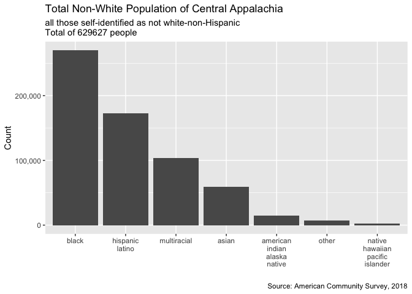
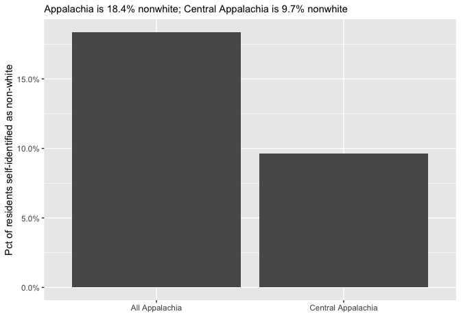
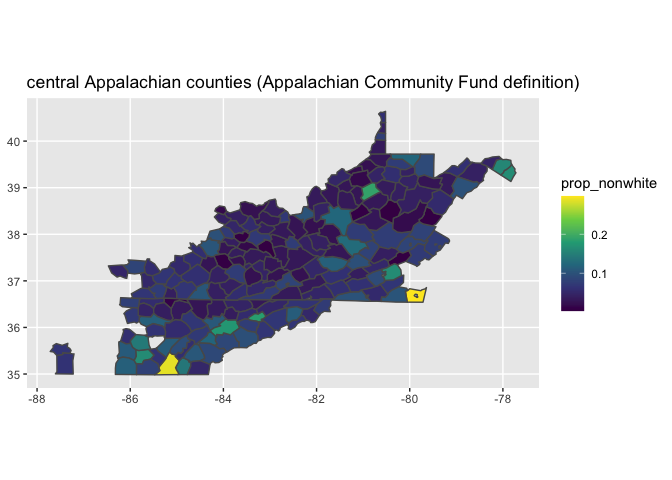

2020-03-17

``` r
# Libraries
library(tidyverse)

# Parameters

appalachian_counties_file <- "../data/appalachian_counties_race.csv"
central_appalachian_counties_file <- 
  "../data/central_appalachian_counties_race.csv"

#===============================================================================

# Code
```

``` r
appalachian_counties_race <- 
  appalachian_counties_file %>%
  read_csv(
    col_types = 
      cols(
        county_name = col_character(), 
        state_name = col_character(),
        .default = col_integer()
      )
  ) %>%
  mutate(
    n_nonwhite = total_population - white,
    prop_nonwhite = n_nonwhite / total_population
  )

central_appalachian_counties_race <-
  central_appalachian_counties_file %>%
  read_csv(
    col_types = 
      cols(
        county_name = col_character(), 
        state_name = col_character(),
        .default = col_integer()
      )
  ) %>%
  mutate(
    n_nonwhite = total_population - white,
    prop_nonwhite = n_nonwhite / total_population
  )
```

``` r
totals_app <-
  appalachian_counties_race %>%
  pivot_longer(
    cols = hispanic_latino:multiracial,
    names_to = "race",
    values_to = "estimate"
  ) %>%
  group_by(race) %>%
  summarize(total = sum(estimate)) 

totals_app %>%
  filter(!(race %in% c("total_population", "white"))) %>%
  ggplot(aes(fct_reorder(race, -total), total)) + 
  geom_col() +
  scale_x_discrete(
    labels = function(x) str_replace_all(x, "_", "\n")
  ) +
  scale_y_continuous(
    labels = scales::label_comma()
  ) +
  labs(
    title = "Total Non-White Population of Appalachia",
    subtitle = 
      str_glue(
        "all those self-identified as not white-non-Hispanic\n",
        "Total of ",
        totals_app %>% 
          filter(!(race %in% c("total_population", "white"))) %>%
          pull(total) %>%
          sum(), 
        " people"
      ),
    x = "",
    y = "Count",
    caption = "Source: American Community Survey, 2018"
  )
```

<!-- -->

``` r
totals_central_app <- 
  central_appalachian_counties_race %>%
  pivot_longer(
    cols = hispanic_latino:multiracial,
    names_to = "race",
    values_to = "estimate"
  ) %>%
  group_by(race) %>%
  summarize(total = sum(estimate))

totals_central_app %>%
  filter(!(race %in% c("total_population", "white"))) %>%
  ggplot(aes(fct_reorder(race, -total), total)) + 
  geom_col() +
  scale_x_discrete(
    labels = function(x) str_replace_all(x, "_", "\n")
  ) +
  scale_y_continuous(
    labels = scales::label_comma()
  ) +
  labs(
    title = "Total Non-White Population of Central Appalachia",
    subtitle = 
      str_glue(
        "all those self-identified as not white-non-Hispanic\n",
        "Total of ",
        totals_central_app %>% 
          filter(!(race %in% c("total_population", "white"))) %>%
          pull(total) %>%
          sum(), 
        " people"
      ),
    x = "",
    y = "Count",
    caption = "Source: American Community Survey, 2018"
  )
```

<!-- -->

``` r
central_appalachian_prop_nonwhite <-
  central_appalachian_counties_race %>%
  summarize(
    n_nonwhite = sum(n_nonwhite),
    total_population = sum(total_population),
    prop_nonwhite = n_nonwhite / total_population
  ) %>%
  pull(prop_nonwhite)

all_appalachia_prop_nonwhite <- 
  appalachian_counties_race %>%
  summarize(
    n_nonwhite = sum(n_nonwhite),
    total_population = sum(total_population),
    prop_nonwhite = n_nonwhite / total_population
  ) %>%
  pull(prop_nonwhite)

tribble(
  ~ region, ~ prop_nonwhite,
  "Central Appalachia", central_appalachian_prop_nonwhite,
  "All Appalachia", all_appalachia_prop_nonwhite
) %>%
  ggplot(aes(region, prop_nonwhite)) +
  geom_col() +
  scale_y_continuous(
    labels = scales::label_percent()
  ) +
  labs(
    subtitle = 
      str_glue(
        "Appalachia is ",
        round(all_appalachia_prop_nonwhite, 3)*100,
        "% nonwhite; ",
        "Central Appalachia is ",
        round(central_appalachian_prop_nonwhite, 3)*100,
        "% nonwhite"
      ),
    x = "",
    y = "Pct of residents self-identified as non-white"
  )
```

<!-- -->

``` r
race_all_appalachia_geometry <- 
  appalachian_counties_race %>%
  left_join(
    (ussf::boundaries("county", projection = "longlat") %>% 
       transmute(fips = as.integer(GEOID), geometry)),
    by = "fips"
  )

race_all_appalachia_geometry %>%
  ggplot(aes(fill = prop_nonwhite, geometry = geometry)) +
  geom_sf() +
  scale_fill_viridis_c() + 
  labs(
    title = "all Appalachian counties (ARC definition)"
  )
```

    ## Warning: Computation failed in `stat_sf()`:
    ## no applicable method for 'st_bbox' applied to an object of class "list"

<!-- -->

``` r
# note differences between regions in Appalachia by restricting data
race_all_appalachia_geometry %>%
  filter(prop_nonwhite < 0.3) %>%
  ggplot(aes(fill = prop_nonwhite, geometry = geometry)) +
  geom_sf() +
  scale_fill_viridis_c() +
  labs(
    title = "restricted to counties with less than 1/3 non-white population"
  )
```

    ## Warning: Computation failed in `stat_sf()`:
    ## no applicable method for 'st_bbox' applied to an object of class "list"

<!-- -->

``` r
# for central appalachia

race_central_appalachia_geometry <- 
  central_appalachian_counties_race %>%
  left_join(
    (ussf::boundaries("county", projection = "longlat") %>% 
       transmute(fips = as.integer(GEOID), geometry)),
    by = "fips"
  )

race_central_appalachia_geometry %>%
  ggplot(aes(fill = prop_nonwhite, geometry = geometry)) +
  geom_sf() +
  scale_fill_viridis_c() + 
  labs(
    title = "central Appalachian counties (Appalachian Community Fund definition)"
  )
```

<!-- -->

``` r
race_central_appalachia_geometry %>%
  filter(prop_nonwhite < 0.2) %>%
  ggplot(aes(fill = prop_nonwhite, geometry = geometry)) +
  geom_sf() +
  scale_fill_viridis_c() + 
  labs(
    title = "Central Appalachian counties (Appalachian Community Fund definition)",
    subtitle = "filtered to prop_nonwhite < 0.2"
  )
```

<!-- -->
