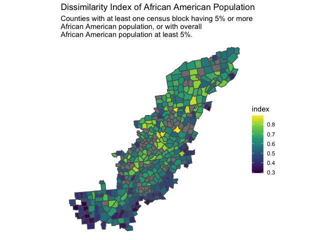
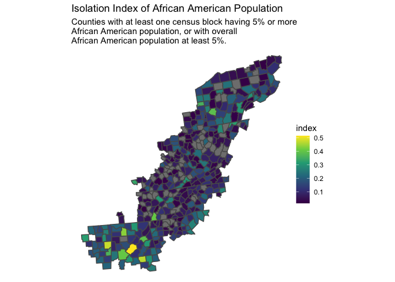
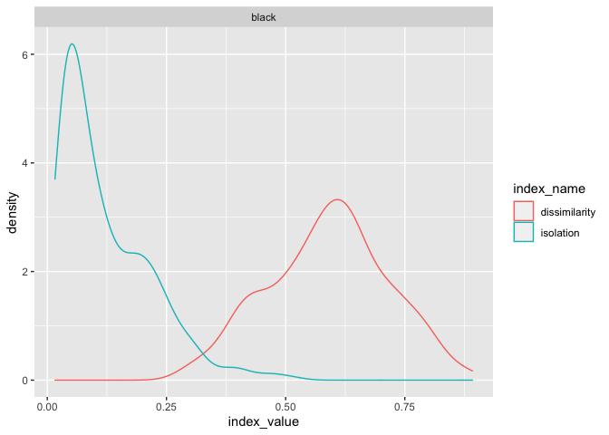
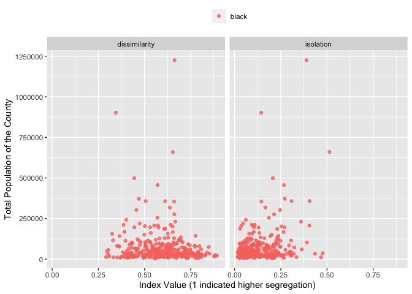
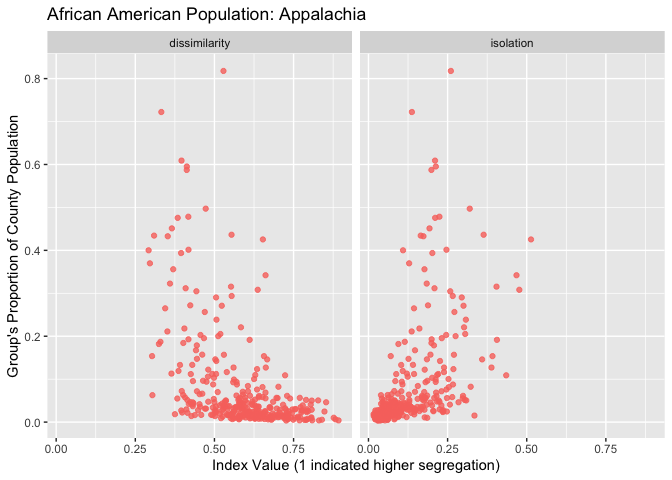

Segregation Indices (calculated from block groups); African American pop
================
Thea Rossman
2020-03-17

  - [isolation index](#isolation-index)
  - [Dissimilarity](#dissimilarity)

``` r
# Libraries
library(tidyverse)
library(tidycensus)

# Parameters

file_race_ethnicity_block_grps <- 
  "../data/appalachian_block_groups_race.csv"
file_centr_race_ethnicity_block_grps <-
  "../data/central_appalachian_block_groups_race.csv"
file_race_ethnicity_counties <- 
  "../data/appalachian_counties_race.csv"

acs5year <- 2018

#===============================================================================

# Code
```

``` r
race_ethnicity_block_grps <- 
  file_race_ethnicity_block_grps %>%
  read_csv(
    col_types = 
      cols(
        census_block_fips = col_character(),
        name = col_character(),
        prop_nonwhite = col_double(),
        .default = col_integer()
      )
  )

race_ethnicity_counties <- 
  file_race_ethnicity_counties %>%
  read_csv(
    col_types = 
      cols(
        county_name = col_character(),
        state_name = col_character(),
        .default = col_integer()
      )
  )
```

Notes on this document:

Most of the code below is copied and pasted from the “tracts” EDA. If
this were production-quality code, I might make a function and think
about how to do this more smoothly and with fewer lines, but this was
more time efficient.

I could not get the numbers to work for Hispanic/Latino populations and
Native American populations.

# isolation index

``` r
# for an index to be counted, 
# counties must contain at least one census tract with prop of population of 
# interest > prop, or must have a total prop of population > prop 
  prop <- 0.05

# filter to counties with at least one tract > prop AA population
counties <- 
  c(
    race_ethnicity_block_grps %>%
      filter(black / total_population > prop) %>%
      pull(county_fips),
    race_ethnicity_counties %>%
      filter(black / total_population > prop) %>%
      pull(fips)
  ) %>%
  unique()
  
race_counties_aa_isolation_index <- 
  race_ethnicity_block_grps %>%
  select(county_fips, name, persons_i = total_population, aa_i = black) %>%
  filter(county_fips %in% counties, persons_i > 0) %>%
  group_by(county_fips) %>%
  summarize(
    aa_total = sum(aa_i),
    pop_total = sum(persons_i),
    prop_aa_county = aa_total / pop_total,
    numerator_1 = sum((aa_i / aa_total) * (aa_i / persons_i))
  ) %>%
  mutate(
    aa_isolation_index = (numerator_1 - prop_aa_county) / (1 - prop_aa_county)
  ) %>% 
  select(county_fips, aa_isolation_index)

race_counties_isolation_indices_block_grps <- 
  race_ethnicity_counties %>% 
  rename(county_fips = fips) %>% 
  left_join(race_counties_aa_isolation_index, by = "county_fips")

race_counties_isolation_indices_block_grps
```

    ## # A tibble: 420 x 13
    ##    county_fips county_name state_name hispanic_latino total_population white
    ##          <int> <chr>       <chr>                <int>            <int> <int>
    ##  1        1007 Bibb        Alabama                547            22527 16801
    ##  2        1009 Blount      Alabama               5261            57645 50232
    ##  3        1015 Calhoun     Alabama               4203           115098 83423
    ##  4        1017 Chambers    Alabama                768            33826 18872
    ##  5        1019 Cherokee    Alabama                398            25853 23730
    ##  6        1021 Chilton     Alabama               3416            43930 35205
    ##  7        1027 Clay        Alabama                415            13378 10740
    ##  8        1029 Cleburne    Alabama                362            14938 13839
    ##  9        1033 Colbert     Alabama               1349            54495 42865
    ## 10        1037 Coosa       Alabama                 50            10855  7084
    ## # … with 410 more rows, and 7 more variables: black <int>,
    ## #   american_indian_alaska_native <int>, asian <int>,
    ## #   native_hawaiian_pacific_islander <int>, other <int>, multiracial <int>,
    ## #   aa_isolation_index <dbl>

# Dissimilarity

``` r
counties <- 
  c(
    race_ethnicity_block_grps %>%
      filter(black / total_population > prop) %>%
      pull(county_fips),
    race_ethnicity_counties %>%
      filter(black / total_population > prop) %>%
      pull(fips)
  ) %>%
  unique()

aa_counties_dissimilarity_index <- 
  race_ethnicity_block_grps %>%
  select(
    county_fips, 
    name, 
    persons_i = total_population, 
    aa_i = black
  ) %>%
  filter(county_fips %in% counties) %>%
  group_by(county_fips) %>%
  summarize(
    aa_total = sum(aa_i),
    aa_c_total = sum(persons_i) - sum(aa_i),
    aa_dissimilarity_index = 
      0.5*sum(abs(aa_i / aa_total - (persons_i - aa_i) / aa_c_total))
  ) %>% 
  select(county_fips, aa_dissimilarity_index)

race_counties_dissimilarity_indices_block_grps <- 
  race_ethnicity_counties %>% 
  rename(county_fips = fips) %>%
  left_join(aa_counties_dissimilarity_index, by = "county_fips")
```

``` r
race_counties_segregation_indices <- 
  race_counties_dissimilarity_indices_block_grps %>%
  left_join(
    race_counties_isolation_indices_block_grps %>% 
      select(
        county_fips, 
        aa_isolation_index
      ), 
    by = "county_fips"
  )
```

``` r
race_counties_segregation_indices
```

    ## # A tibble: 420 x 14
    ##    county_fips county_name state_name hispanic_latino total_population white
    ##          <int> <chr>       <chr>                <int>            <int> <int>
    ##  1        1007 Bibb        Alabama                547            22527 16801
    ##  2        1009 Blount      Alabama               5261            57645 50232
    ##  3        1015 Calhoun     Alabama               4203           115098 83423
    ##  4        1017 Chambers    Alabama                768            33826 18872
    ##  5        1019 Cherokee    Alabama                398            25853 23730
    ##  6        1021 Chilton     Alabama               3416            43930 35205
    ##  7        1027 Clay        Alabama                415            13378 10740
    ##  8        1029 Cleburne    Alabama                362            14938 13839
    ##  9        1033 Colbert     Alabama               1349            54495 42865
    ## 10        1037 Coosa       Alabama                 50            10855  7084
    ## # … with 410 more rows, and 8 more variables: black <int>,
    ## #   american_indian_alaska_native <int>, asian <int>,
    ## #   native_hawaiian_pacific_islander <int>, other <int>, multiracial <int>,
    ## #   aa_dissimilarity_index <dbl>, aa_isolation_index <dbl>

``` r
counties_segregation_geo <- 
  race_counties_segregation_indices %>%
  left_join(
    ussf::boundaries(geography = "county") %>%
      transmute(county_fips = as.integer(GEOID), geometry),
    by = "county_fips"
  )
  
plot_segregation <- function(tibble, group, index) {
  tibble %>%
    ggplot(aes(geometry = geometry, fill = index)) + 
    geom_sf() + 
    scale_fill_viridis_c() +
    theme_void() + 
    labs(
      title = str_glue(index, " of ", group, " Population"),
      subtitle = 
        str_glue("Counties with at least one census block having ", 
                 prop*100,
                 "% or more\n",
                 group, 
                 " population, or with overall\n", 
                 group, 
                 " population at least ", 
                 prop*100, 
                 "%."
                )
    )
}

plot_segregation(
  counties_segregation_geo %>% 
    select(
      index = aa_dissimilarity_index,
      geometry
    ),
  group = "African American",
  index = "Dissimilarity Index"
)
```

<!-- -->

``` r
plot_segregation(
  counties_segregation_geo %>% 
    select(
      index = aa_isolation_index,
      geometry
    ),
  group = "African American",
  index = "Isolation Index"
)
```

<!-- -->

``` r
segregation_indices_pivoted <- 
  race_counties_segregation_indices %>%
  select(
    county_fips,
    county_name,
    state_name,
    total_population,
    black,
    isolation_black = aa_isolation_index,
    dissimilarity_black = aa_dissimilarity_index,
  ) %>%
  pivot_longer(
    cols = c(isolation_black, dissimilarity_black),
    names_to = c("index_name", "race_ethn"),
    names_sep = "_",
    values_to = "index_value"
  ) %>%
  drop_na() %>%
  mutate(
    pop_group = 
      case_when(
        race_ethn == "black" ~ black
      ),
    prop_of_population = pop_group / total_population
  )


segregation_indices_pivoted %>%
  ggplot(aes(index_value, color = index_name)) +
  geom_density() +
  facet_grid(cols = vars(race_ethn))
```

<!-- -->

``` r
segregation_indices_pivoted %>%
  ggplot(aes(index_value, color = fct_reorder(race_ethn,index_value))) +
  geom_density() +
  facet_grid(cols = vars(index_name)) +
  theme(legend.position = "top") +
  labs(
    x = "Index Value (1 indicated higher segregation)",
    y = "Density (Number of Counties)",
    color = ""
  )
```

<!-- -->

``` r
segregation_indices_pivoted %>%
  sample_frac() %>%
  ggplot(aes(index_value, total_population, color = race_ethn)) +
  geom_point(alpha = 0.8) +
  facet_grid(cols = vars(index_name)) +
  theme(legend.position = "top") +
  labs(
    x = "Index Value (1 indicated higher segregation)",
    y = "Total Population of the County",
    color = ""
  )
```

<!-- -->

``` r
segregation_indices_pivoted %>%
  sample_frac() %>%
  ggplot(aes(index_value, prop_of_population, color = race_ethn)) +
  geom_point(alpha = 0.8) +
  facet_grid(cols = vars(index_name)) +
  theme(legend.position = "top") +
  guides(color = "none") +
  labs(
    title = "African American Population: Appalachia",
    x = "Index Value (1 indicated higher segregation)",
    y = "Group's Proportion of County Population",
    color = ""
  )
```

<!-- -->

``` r
segregation_indices_pivoted %>%
  filter(race_ethn == "black") %>%
  ggplot(aes(index_value, color = index_name)) + 
  geom_density() +
  facet_wrap(vars(state_name)) +
  theme(legend.position = "top") +
  labs(title = "Af. Am population")
```

<!-- -->
