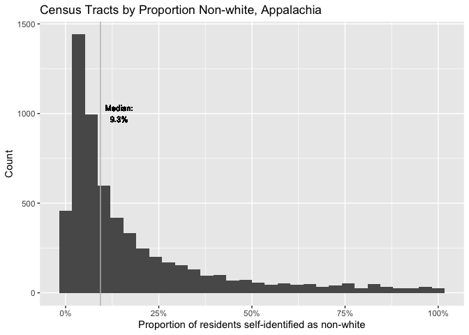
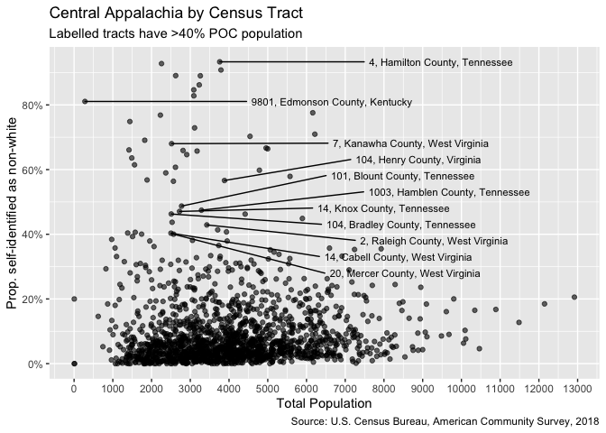
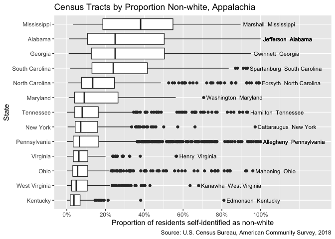

2020-03-17

``` r
# Libraries
library(tidyverse)
library(tidycensus)

# Parameters

census_tracts_file <- "../data/appalachian_tracts_race.csv"
central_census_tracts_file <- "../data/central_appalachian_tracts_race.csv"
appalachian_counties_file <- "../data/appalachian_counties_fips.csv"

#===============================================================================

# Code
```

``` r
appalachia_tracts_race <-
  census_tracts_file %>%
  read_csv(
    col_types = 
      cols(
        fips = col_character(),
        name = col_character(),
        prop_nonwhite = col_double(),
        .default = col_integer()
      )
  )

central_appalachia_tracts_race <- 
  central_census_tracts_file %>%
  read_csv(
    col_types = 
      cols(
        fips = col_character(),
        name = col_character(),
        prop_nonwhite = col_double(),
        .default = col_integer()
      )
  )

appalachia_tracts_race %>%
  arrange(desc(prop_nonwhite))
```

    ## # A tibble: 6,107 x 14
    ##    fips  county_fips name  hispanic_latino total_population white black
    ##    <chr>       <int> <chr>           <int>            <int> <int> <int>
    ##  1 0107…        1073 Cens…              50             2744     0  2669
    ##  2 0107…        1073 Cens…              81             2619     0  2538
    ##  3 0107…        1073 Cens…             169             1906     0  1729
    ##  4 0107…        1073 Cens…               0             1960     0  1947
    ##  5 0107…        1073 Cens…               0              969     0   969
    ##  6 4200…       42003 Cens…              38             1292     0  1243
    ##  7 4200…       42003 Cens…               0              170     0   170
    ##  8 0112…        1125 Cens…              22             3194     6  3157
    ##  9 0107…        1073 Cens…              36             1802     9  1757
    ## 10 0108…        1087 Cens…               0             1387     7  1364
    ## # … with 6,097 more rows, and 7 more variables:
    ## #   american_indian_alaska_native <int>, asian <int>,
    ## #   native_hawaiian_pacific_islander <int>, other <int>, multiracial <int>,
    ## #   n_nonwhite <int>, prop_nonwhite <dbl>

``` r
central_appalachia_tracts_race %>%
  arrange(desc(prop_nonwhite))
```

    ## # A tibble: 1,608 x 14
    ##    fips  county_fips name  hispanic_latino total_population white black
    ##    <chr>       <int> <chr>           <int>            <int> <int> <int>
    ##  1 4706…       47065 Cens…               5             3760   251  3424
    ##  2 4706…       47065 Cens…              26             2257   163  2068
    ##  3 4706…       47065 Cens…               0             3792   349  3413
    ##  4 4706…       47065 Cens…              28             2623   287  2263
    ##  5 4706…       47065 Cens…               8             3259   358  2764
    ##  6 4706…       47065 Cens…              11             3231   446  2629
    ##  7 4706…       47065 Cens…             133             3090   474  2340
    ##  8 4709…       47093 Cens…             119             3091   531  2256
    ##  9 2106…       21061 Cens…              34              280    53   133
    ## 10 4706…       47065 Cens…             199             6162  1382  4444
    ## # … with 1,598 more rows, and 7 more variables:
    ## #   american_indian_alaska_native <int>, asian <int>,
    ## #   native_hawaiian_pacific_islander <int>, other <int>, multiracial <int>,
    ## #   n_nonwhite <int>, prop_nonwhite <dbl>

``` r
median <- 
  appalachia_tracts_race %>% pull(prop_nonwhite) %>% median(na.rm = TRUE)

appalachia_tracts_race %>%
  drop_na(prop_nonwhite) %>%
  ggplot(aes(prop_nonwhite)) +
  geom_histogram(bins = 30) +
  geom_vline(xintercept = median, color = "grey") +
  geom_text(
    aes(
      x = median + 0.05, 
      y = 1000, 
      label = str_glue("Median:\n", round(median, 3)*100, "%")
    ),
    size = 3
  ) + 
  scale_x_continuous(labels = scales::label_percent()) +
  labs(
    title = "Census Tracts by Proportion Non-white, Appalachia",
    x = "Proportion of residents self-identified as non-white",
    y = "Count"
  )
```

<!-- -->

``` r
median <- 
  central_appalachia_tracts_race %>% pull(prop_nonwhite) %>% median(na.rm = TRUE)

central_appalachia_tracts_race %>%
  drop_na(prop_nonwhite) %>%
  ggplot(aes(prop_nonwhite)) +
  geom_histogram(bins = 30) +
  geom_vline(xintercept = median, color = "grey") +
  geom_text(
    aes(
      x = median + 0.05, 
      y = 1000, 
      label = str_glue("Median:\n", round(median, 3)*100, "%")
    ),
    size = 3
  ) + 
  scale_x_continuous(labels = scales::label_percent()) +
  labs(
    title = "Census Tracts by Proportion Non-white, Central Appalachia",
    x = "Proportion of residents self-identified as non-white",
    y = "Count"
  )
```

<!-- -->

``` r
central_appalachia_tracts_race %>%
  drop_na(total_population, prop_nonwhite) %>%
  ggplot(aes(total_population, prop_nonwhite)) + 
  geom_point(alpha = 0.6) +
  ggrepel::geom_text_repel(
    aes(label = name %>% str_remove("Census Tract")),
    data = 
      . %>% 
      filter(prop_nonwhite > 0.40) %>%
      distinct(county_fips, .keep_all = TRUE),
    size = 3,
    direction = "y",
    hjust = -1
  ) +
  scale_x_continuous(breaks = scales::breaks_width(1000)) +
  scale_y_continuous(
    breaks = scales::breaks_width(0.2),
    labels = scales::label_percent()
  ) +
  labs(
    title = "Central Appalachia by Census Tract",
    subtitle = "Labelled tracts have >40% POC population",
    y = "Prop. self-identified as non-white",
    x = "Total Population",
    caption = "Source: U.S. Census Bureau, American Community Survey, 2018"
  )
```

<!-- -->

``` r
appalachian_counties <- 
  appalachian_counties_file %>%
  read_csv(col_types = cols(fips = col_integer(), .default = col_character()))

app_state_fips <-
  appalachian_counties %>%
  transmute(
    state_fips = fips %/% 1000,
    state_name
  ) %>%
  distinct(state_fips, state_name)

appalachia_tracts_race %>%
  mutate(state_fips = county_fips %/% 1000) %>%
  left_join(app_state_fips, by = "state_fips") %>%
  drop_na(state_fips, prop_nonwhite) %>%
  ggplot(aes(fct_reorder(state_name, prop_nonwhite), prop_nonwhite)) +
  geom_boxplot() +
  scale_y_continuous(
    breaks = seq(0, 1, 0.2),
    labels = scales::label_percent(),
    limits = c(0, 1.3)
  ) +
  geom_text(
    aes(
      label = name %>% 
        str_remove("Census Tract") %>%
        str_remove("County") %>%
        str_remove_all("[:digit:]") %>%
        str_remove_all(",") %>%
        str_remove_all("\\.")
    ),
    data = 
      . %>% 
      group_by(state_name) %>%
      top_n(1, wt = prop_nonwhite),
    size = 3,
    hjust = 0.01
  ) + 
  coord_flip() +
  labs(
    title = "Census Tracts by Proportion Non-white, Appalachia",
    x = "State",
    y = "Proportion of residents self-identified as non-white",
    caption = "Source: U.S. Census Bureau, American Community Survey, 2018"
  )
```

<!-- -->

``` r
label_counties <- function(x) {
  x %>% 
    str_remove("Census Tract") %>% 
    str_remove_all("[:digit:]") %>%
    str_remove(",")
}

central_appalachia_tracts_race %>%
  drop_na(total_population, prop_nonwhite) %>%
  filter(prop_nonwhite == 0) %>%
  ggplot(aes(fct_reorder(name, total_population), total_population)) + 
  geom_point(alpha = 0.6) +
  scale_x_discrete(
    labels = label_counties
  ) +
  coord_flip() +
  labs(
    title = "Census Tracts with 0% Recorded POC Population",
    subtitle = "Central Appalachia",
    y = "Total Population",
    x = "",
    caption = "Source: U.S. Census Bureau, American Community Survey, 2018"
  )
```

<!-- -->

``` r
central_appalachia_tracts_race %>%
  filter(prop_nonwhite > .6) %>%
  ggplot(aes(x = fct_reorder(name, prop_nonwhite), y = prop_nonwhite)) + 
  geom_point() + 
  scale_x_discrete(labels = label_counties) +
  scale_y_continuous(breaks = scales::breaks_width(0.05)) +
  coord_flip() +
  labs(
    title = "Census tracts in Central Appalachia >60% nonwhite",
    y = "Prop. of residents self-identified as non-white",
    x = ""
  )
```

<!-- -->
