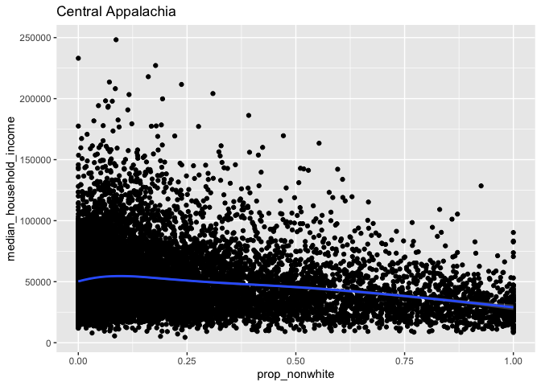
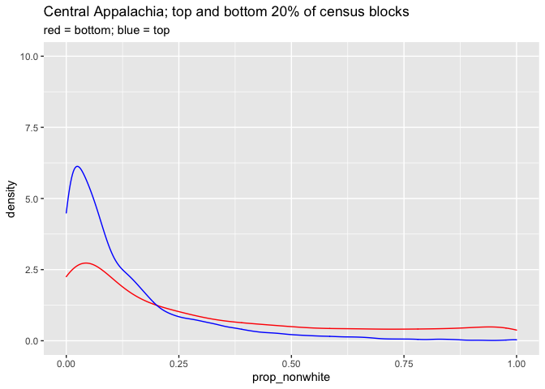
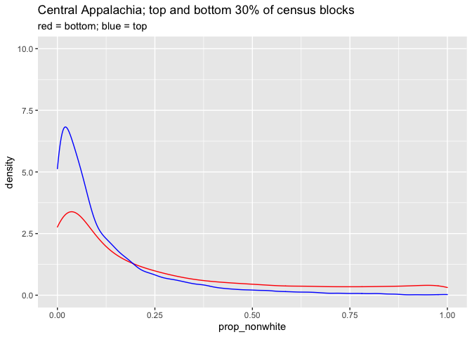
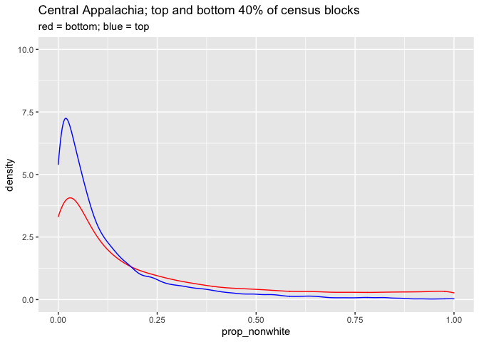

Median Income & Segregation
================
Thea Rossman
2020-03-17

``` r
# Libraries
library(tidyverse)
library(tidycensus)

# Parameters

census_groups_file_income <- 
  "../data/appalachian_race_income.csv"
census_groups_file_race <- 
  "../data/appalachian_block_groups_race.csv"

census_groups_central_file_income <-
  "../data/central_appalachian_race_income.csv"
census_groups_central_file_race <-
  "../data/central_appalachian_block_groups_race.csv"
  
appalachian_counties_file <- "../data/appalachian_counties_fips.csv"


#===============================================================================

# Code
```

``` r
race_med_income <- 
  census_groups_file_income %>%
  read_csv(
    col_types = 
      cols(
        census_block_fips = col_character(),
        name = col_character(),
        .default = col_integer()
      )
  ) 

groups_race <-
  census_groups_file_race %>%
  read_csv(
    col_types = 
      cols(
        census_block_fips = col_character(),
        name = col_character(),
        prop_nonwhite = col_double(), 
        .default = col_integer()
      )
  ) %>%
  select(
    census_block_fips, 
    county_fips, 
    total_population,
    white, 
    black, 
    prop_nonwhite
  )

groups_race_income <- 
  groups_race %>%
  left_join(
    race_med_income, 
    by = c("census_block_fips", "county_fips")
  )

groups_race_income %>%
  drop_na() %>%
  ggplot(aes(prop_nonwhite, median_household_income)) +
  geom_point() +
  geom_smooth() +
  labs(title = "Appalachia")
```

    ## `geom_smooth()` using method = 'gam' and formula 'y ~ s(x, bs = "cs")'

<!-- -->

``` r
groups_race_income %>%
  filter(prop_nonwhite > 0.75, median_household_income > 100000)
```

    ## # A tibble: 4 x 8
    ##   census_block_fi… county_fips total_population white black prop_nonwhite name 
    ##   <chr>                  <int>            <int> <int> <int>         <dbl> <chr>
    ## 1 130970804042           13097             1354   174  1156         0.871 Bloc…
    ## 2 131350505362           13135             1464   248   641         0.831 Bloc…
    ## 3 131350507284           13135             1716   242  1441         0.859 Bloc…
    ## 4 420035231003           42003             1039    77   858         0.926 Bloc…
    ## # … with 1 more variable: median_household_income <int>

Central app:

``` r
race_med_income_central <- 
  census_groups_central_file_income %>%
  read_csv(
    col_types = 
      cols(
        census_block_fips = col_character(),
        name = col_character(),
        .default = col_integer()
      )
  ) 

groups_race_central <-
  census_groups_central_file_race %>%
  read_csv(
    col_types = 
      cols(
        census_block_fips = col_character(),
        name = col_character(),
        prop_nonwhite = col_double(), 
        .default = col_integer()
      )
  ) %>%
  select(
    census_block_fips, 
    county_fips, 
    total_population,
    white, 
    black, 
    prop_nonwhite
  )

groups_race_income_central <- 
  groups_race %>%
  left_join(
    race_med_income, 
    by = c("census_block_fips", "county_fips")
  )

groups_race_income_central %>%
  drop_na() %>%
  ggplot(aes(prop_nonwhite, median_household_income)) +
  geom_point() +
  geom_smooth() +
  labs(title = "Central Appalachia")
```

    ## `geom_smooth()` using method = 'gam' and formula 'y ~ s(x, bs = "cs")'

<!-- -->

``` r
# high-income census blocks

groups_race_income_central %>%
  filter(median_household_income > 130000) %>%
  arrange(desc(median_household_income)) %>%
  select(
    name, 
    median_household_income, 
    white, 
    black, 
    total_population, 
    everything()
  )
```

    ## # A tibble: 174 x 8
    ##    name  median_househol… white black total_population census_block_fi…
    ##    <chr>            <int> <int> <int>            <int> <chr>           
    ##  1 Bloc…           248250  1158    31             1268 370670025013    
    ##  2 Bloc…           233077   872     0              872 010730129112    
    ##  3 Bloc…           227143   778    32              946 420034736011    
    ##  4 Bloc…           217969  1268    13             1511 420034741012    
    ##  5 Bloc…           213571   715     2              770 420035633002    
    ##  6 Bloc…           211625   653    48              856 370670040103    
    ##  7 Bloc…           208167  2861    23             3127 010730127031    
    ##  8 Bloc…           204167   750   231             1086 540390011001    
    ##  9 Bloc…           203322  2803     0             3173 131171306123    
    ## 10 Bloc…           199821   429    25              532 420030201003    
    ## # … with 164 more rows, and 2 more variables: county_fips <int>,
    ## #   prop_nonwhite <dbl>

Notes:

  - Kanawha County, WV: contains Charleston
  - Knox County, TN: contains Knoxville
  - Mon County, WV: contains Morgantown
  - Hamilton County, TN: contains Chattanooga
  - Anderson County, TN: contained in the Knoxville Metropolitan
    Statistical Area
  - Montgomery County, VA: contains Christiansburg; close to Virginia
    Tech & Blacksburg

<!-- end list -->

``` r
groups_race_income_central %>%
  filter(median_household_income < 10000) %>%
  arrange(median_household_income) %>%
  select(
    name, 
    median_household_income, 
    white, 
    black, 
    total_population, 
    everything()
  )
```

    ## # A tibble: 30 x 8
    ##    name  median_househol… white black total_population census_block_fi…
    ##    <chr>            <int> <int> <int>            <int> <chr>           
    ##  1 Bloc…             4391   754    35              999 540610102025    
    ##  2 Bloc…             5202   515    18              635 011250120003    
    ##  3 Bloc…             5556  1265    40             1380 011250114013    
    ##  4 Bloc…             7128  3189   170             4132 390099739012    
    ##  5 Bloc…             7973   490    16              506 211219301002    
    ##  6 Bloc…             8397     0  1061             1209 010730023031    
    ##  7 Bloc…             8457    41   299              340 010730101001    
    ##  8 Bloc…             8649    37   125              162 011030006002    
    ##  9 Bloc…             9005     0  1138             1170 010890012003    
    ## 10 Bloc…             9099   296   177              564 420034886002    
    ## # … with 20 more rows, and 2 more variables: county_fips <int>,
    ## #   prop_nonwhite <dbl>

``` r
plot_percentile <- function(p) {
  
  # groups in lowest p% of income
  groups_race_income_central %>%
    ggplot(aes(prop_nonwhite)) +
    geom_density(
      data = 
      . %>%
        filter(
          median_household_income < 
            quantile(
              groups_race_income_central$median_household_income,
              probs = p,
              na.rm = TRUE
            )
        ),
      color = "red"
    ) +
    geom_density(
      data = 
      . %>%
        filter(
          median_household_income >
            quantile(
              groups_race_income_central$median_household_income,
              probs = 1 - p,
              na.rm = TRUE
            )
        ),
      color = "blue"
    ) +
    scale_x_continuous(limits = c(0, 1)) +
    scale_y_continuous(limits = c(0, 10)) +
    labs(
      title = 
        str_glue(
          "Central Appalachia; top and bottom ",
          p*100,
          "% of census blocks"
        ),
      subtitle = "red = bottom; blue = top"
    )
}

seq(0.1, 0.5, 0.1) %>%
  map(plot_percentile)
```

    ## [[1]]

<!-- -->

    ## 
    ## [[2]]

<!-- -->

    ## 
    ## [[3]]

<!-- -->

    ## 
    ## [[4]]

<!-- -->

    ## 
    ## [[5]]

<!-- -->
