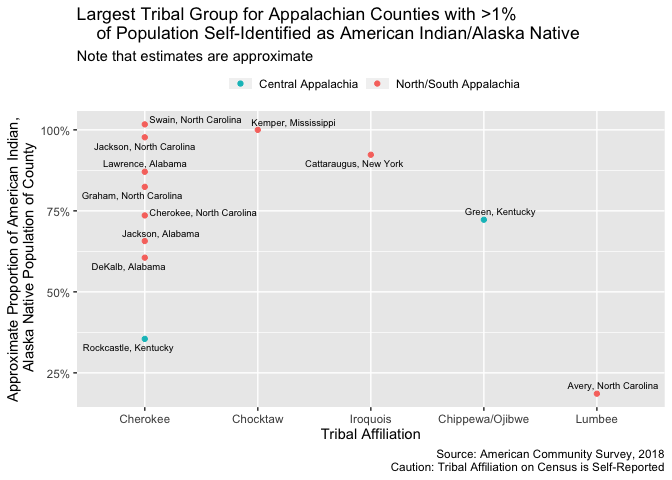
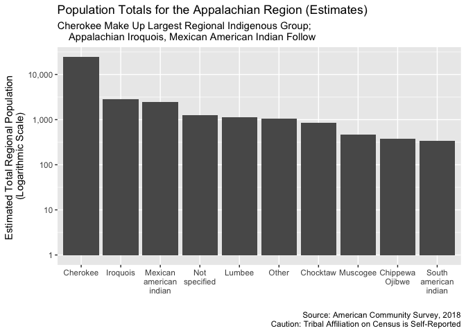

2020-03-17

  - [Tribal Affiliation](#tribal-affiliation)
      - [Note: this was originally included in the c01, but I moved it
        here](#note-this-was-originally-included-in-the-c01-but-i-moved-it-here)
      - [American Indian/Alaska Native Distribution by Tribal
        Group](#american-indianalaska-native-distribution-by-tribal-group)
  - [Hispanic/Latino Origin](#hispaniclatino-origin)

``` r
# Libraries
library(tidyverse)
library(tidycensus)

# Parameters

app_counties_race_file <-
  "../data/appalachian_counties_race.csv"
cent_app_counties_fips_file <- 
  "../data/central_appalachian_counties_fips.csv"

vars <- 
  c(
    apache = "B02014_003",
    arapaho = "B02014_004",
    blackfeet = "B02014_005",
    canadian_american_indian = "B02014_006",
    central_american_indian = "B02014_007",
    cherokee = "B02014_008",
    cheyenne = "B02014_009",
    chickasaw = "B02014_010",
    `chippewa/ojibwe` = "B02014_011",
    chocktaw = "B02014_012",
    colville = "B02014_013",
    comanche = "B02014_014",
    cree = "B02014_015",
    muscogee = "B02014_016", # referred to as Creek in Census
    crow = "B02014_017",
    caddo = "B02014_018", # referred to as Delaware in Census
    hopi = "B02014_019",
    houma = "B02014_020",
    iroquois = "B02014_021",
    kiowa = "B02014_022",
    lumbee = "B02014_023",
    menominee = "B02014_024",
    mexican_american_indian = "B02014_025",
    dine = "B02014_026", # referred to as Navajo in Census
    osage = "B02014_027",
    ottawa = "B02014_028",
    paiute = "B02014_029",
    pima = "B02014_030",
    potawatomi = "B02014_031",
    pueblo = "B02014_032",
    puget_sound_salish = "B02014_033",
    seminole = "B02014_034",
    shoshone = "B02014_035",
    lakota = "B02014_036", # referred to as Sioux in census
    south_american_indian = "B02014_037",
    spanish_american_indian = "B02014_038",
    tohono_o.odham = "B02014_039",
    ute = "B02014_040",
    yakama = "B02014_041",
    yaqui = "B02014_042",
    yuman = "B02014_043",
    other = "B02014_044",
    not_specified = "B02014_045",
    alaska_native = "B02014_046"
  )

vars_hisp <- 
  c(
    mexico = "B03001_004",
    puerto_rico = "B03001_005",
    cuba = "B03001_006",
    dominican_rep = "B03001_007",
    central_america = "B03001_008",
    south_america = "B03001_016"
  )

file_out_nativeam <- 
  "../data/appalachia_tribal_groups.csv"

file_out_nativeam_total_estimates <- 
  "../data/appalachia_tribal_groups_totals.csv"

acs5_year <- 2018


app_tribal_groups_file <- 
  "../data/appalachia_tribal_groups.csv"
app_tribal_groups_total_estimates_file <-
  "../data/appalachia_tribal_groups_totals.csv"

#===============================================================================

# Code
```

``` r
app_counties_race <- 
  app_counties_race_file %>%
  read_csv(
    col_types = 
      cols(
        county_name = col_character(),
        state_name = col_character(),
        .default = col_integer()
      )
  )

cent_app_county_fips <-
  cent_app_counties_fips_file %>%
  read_csv(
    col_types = cols(fips = col_integer(), .default = col_character())
  ) %>%
  pull(fips)
```

# Tribal Affiliation

``` r
native_am_over_1 <- 
  app_counties_race %>%
  mutate(
    prop_native = 
      (american_indian_alaska_native / total_population) %>% round(digits = 4)
  ) %>%
  filter(prop_native > 0.01) %>%
  arrange(desc(prop_native))
  
native_am_census <- 
  get_acs(
    geography = "county",
    variables = vars,
    year = 2018
  ) %>%
  transmute(
    fips = as.integer(GEOID), 
    name = NAME, 
    variable, 
    estimate, 
    moe
  ) %>%
  filter(
    fips %in% (app_counties_race %>% pull(fips)), 
    estimate > 0,
    moe < estimate
  ) %>%
  left_join(
    get_acs(
      geography = "county",
      variables = c(american_indian_tot = "B02010_001"),
      year = 2018
    ) %>%
      transmute(fips = as.integer(GEOID), variable, estimate) %>%
      pivot_wider(names_from = variable, values_from = estimate),
    by = "fips"
  ) %>%
  mutate(prop = (estimate / american_indian_tot) %>% round(digits = 4))
```

    ## Getting data from the 2014-2018 5-year ACS
    ## Getting data from the 2014-2018 5-year ACS

``` r
native_am_census %>%
  select(name, variable, estimate, prop, moe, american_indian_tot) %>%
  arrange(desc(american_indian_tot, prop)) 
```

    ## # A tibble: 196 x 6
    ##    name                variable         estimate    prop   moe american_indian_…
    ##    <chr>               <chr>               <dbl>   <dbl> <dbl>             <dbl>
    ##  1 Gwinnett County, G… cherokee              351 0.0368    194              9540
    ##  2 Gwinnett County, G… chippewa/ojibwe       105 0.011      68              9540
    ##  3 Gwinnett County, G… mexican_america…      828 0.0868    435              9540
    ##  4 Allegheny County, … cherokee              228 0.0246     96              9287
    ##  5 Allegheny County, … chippewa/ojibwe        54 0.00580    41              9287
    ##  6 Allegheny County, … caddo                  75 0.0081     51              9287
    ##  7 Allegheny County, … iroquois               86 0.00930    83              9287
    ##  8 Allegheny County, … pueblo                 49 0.0053     43              9287
    ##  9 Allegheny County, … other                  87 0.0094     60              9287
    ## 10 Allegheny County, … not_specified         173 0.0186    104              9287
    ## # … with 186 more rows

``` r
native_am_census %>%
  select(name, variable, estimate, prop, moe, american_indian_tot) %>%
  arrange(desc(prop))
```

    ## # A tibble: 196 x 6
    ##    name                    variable      estimate  prop   moe american_indian_t…
    ##    <chr>                   <chr>            <dbl> <dbl> <dbl>              <dbl>
    ##  1 Kemper County, Mississ… chocktaw           370 1        20                370
    ##  2 Swain County, North Ca… cherokee          4029 0.855   353               4713
    ##  3 Hart County, Kentucky   cherokee           102 0.823    46                124
    ##  4 Graham County, North C… cherokee           740 0.750   147                986
    ##  5 Jackson County, North … cherokee          3198 0.737   313               4337
    ##  6 Cattaraugus County, Ne… iroquois          2113 0.680   112               3106
    ##  7 Green County, Kentucky  chippewa/oji…      224 0.638   196                351
    ##  8 Grainger County, Tenne… cherokee            76 0.567    66                134
    ##  9 Itawamba County, Missi… chocktaw            73 0.557    60                131
    ## 10 Marshall County, West … cree               112 0.554    89                202
    ## # … with 186 more rows

``` r
native_am_census %>%
  select(name, variable, estimate, prop, moe, american_indian_tot) %>%
  arrange(desc(estimate))
```

    ## # A tibble: 196 x 6
    ##    name                 variable         estimate   prop   moe american_indian_…
    ##    <chr>                <chr>               <dbl>  <dbl> <dbl>             <dbl>
    ##  1 Swain County, North… cherokee             4029 0.855    353              4713
    ##  2 Jackson County, Nor… cherokee             3198 0.737    313              4337
    ##  3 Cattaraugus County,… iroquois             2113 0.680    112              3106
    ##  4 Lawrence County, Al… cherokee             1635 0.506    313              3230
    ##  5 Madison County, Ala… cherokee             1197 0.183    288              6527
    ##  6 Gwinnett County, Ge… mexican_america…      828 0.0868   435              9540
    ##  7 Greenville County, … mexican_america…      746 0.150    585              4956
    ##  8 Graham County, Nort… cherokee              740 0.750    147               986
    ##  9 Jefferson County, A… cherokee              555 0.116    264              4795
    ## 10 Morgan County, Alab… cherokee              553 0.268    249              2067
    ## # … with 186 more rows

``` r
native_am_census %>%
  filter(fips %in% (native_am_over_1 %>% pull(fips))) %>%
  select(name, variable, estimate, prop, moe, american_indian_tot) %>%
  arrange(desc(prop))
```

    ## # A tibble: 17 x 6
    ##    name                   variable      estimate    prop   moe american_indian_…
    ##    <chr>                  <chr>            <dbl>   <dbl> <dbl>             <dbl>
    ##  1 Kemper County, Missis… chocktaw           370 1          20               370
    ##  2 Swain County, North C… cherokee          4029 0.855     353              4713
    ##  3 Graham County, North … cherokee           740 0.750     147               986
    ##  4 Jackson County, North… cherokee          3198 0.737     313              4337
    ##  5 Cattaraugus County, N… iroquois          2113 0.680     112              3106
    ##  6 Green County, Kentucky chippewa/oji…      224 0.638     196               351
    ##  7 Lawrence County, Alab… cherokee          1635 0.506     313              3230
    ##  8 Cherokee County, Nort… cherokee           287 0.355     114               809
    ##  9 DeKalb County, Alabama cherokee           551 0.300     213              1837
    ## 10 Rockcastle County, Ke… cherokee            66 0.281      62               235
    ## 11 Green County, Kentucky cherokee            86 0.245      68               351
    ## 12 Jackson County, Alaba… cherokee           358 0.214     158              1676
    ## 13 Avery County, North C… lumbee              44 0.137      41               322
    ## 14 DeKalb County, Alabama muscogee           232 0.126     206              1837
    ## 15 Avery County, North C… lakota              22 0.0683     21               322
    ## 16 Cattaraugus County, N… not_specified       17 0.0055     14              3106
    ## 17 Cattaraugus County, N… alaska_native       15 0.00480    13              3106

``` r
totals <- 
  native_am_census %>%
  group_by(variable) %>%
  summarize(total_population_est = sum(estimate))

totals %>%
  arrange(desc(total_population_est))
```

    ## # A tibble: 20 x 2
    ##    variable                total_population_est
    ##    <chr>                                  <dbl>
    ##  1 cherokee                               24675
    ##  2 iroquois                                2846
    ##  3 mexican_american_indian                 2465
    ##  4 not_specified                           1246
    ##  5 lumbee                                  1140
    ##  6 other                                   1047
    ##  7 chocktaw                                 856
    ##  8 muscogee                                 465
    ##  9 chippewa/ojibwe                          383
    ## 10 south_american_indian                    344
    ## 11 apache                                   177
    ## 12 lakota                                   160
    ## 13 cree                                     112
    ## 14 dine                                      97
    ## 15 pima                                      85
    ## 16 caddo                                     75
    ## 17 potawatomi                                66
    ## 18 pueblo                                    49
    ## 19 alaska_native                             45
    ## 20 blackfeet                                 42

Notes:

  - Kemper County contains parts of the [Mississippi Choctaw Indian
    Reservation](https://en.wikipedia.org/wiki/Mississippi_Band_of_Choctaw_Indians#Government).
  - Swain, Graham, and Jackson County, NC contain parts of the [Qualla
    Boundary](https://en.wikipedia.org/wiki/Qualla_Boundary), where the
    Eastern Band of Cherokee Indians holds land.
  - Lawrence County, Alabama has, according to
    [Wikipedia](https://en.wikipedia.org/wiki/Lawrence_County,_Alabama),
    the largest population of people who identify as Native American in
    the state. It seems that approximately 50% of them are affiliated
    with the Cherokee Nation.
  - Large numbers of Mexican American Indian individuals in Gwinnett
    County, GA and Greenville County, SC, both of which contain major
    metropolitan areas.
  - Cattaraugus County, New York contains part of the [Cattaraugus
    Reservation](https://en.wikipedia.org/wiki/Cattaraugus_Reservation)
    of the Seneca Nation

Huge margins of error… decennial might be better for this

``` r
native_am_census %>%
  filter(prop > 0.1, estimate != 0) %>%
  ggplot(aes(prop, fill = variable)) +
  geom_histogram(position = "dodge", binwidth = 0.1) +
  labs(
    x = "proportion of Native American pop identified with tribal grouping"
  )
```

<!-- -->

``` r
native_am_census %>%
  filter(prop > 0.1, estimate != 0, variable != "cherokee") %>%
  ggplot(aes(prop, american_indian_tot, color = variable)) +
  geom_point() +
  labs(
    x = "proportion of Native American pop identified with tribal grouping"
  )
```

<!-- -->

``` r
native_am_census %>%
  filter(str_detect(name, "Virginia")) %>% # VA and WV
  filter(estimate > 0, moe < estimate) %>%
  arrange(desc(estimate))
```

    ## # A tibble: 13 x 7
    ##     fips name                variable    estimate   moe american_indian_…   prop
    ##    <int> <chr>               <chr>          <dbl> <dbl>             <dbl>  <dbl>
    ##  1 54039 Kanawha County, We… cherokee         207   114              1708 0.121 
    ##  2 51121 Montgomery County,… cherokee         162   144               566 0.286 
    ##  3 54081 Raleigh County, We… cherokee         130   106               621 0.209 
    ##  4 54055 Mercer County, Wes… cherokee         123    78               380 0.324 
    ##  5 54049 Marion County, Wes… cherokee         121   111               381 0.318 
    ##  6 54051 Marshall County, W… cree             112    89               202 0.554 
    ##  7 54061 Monongalia County,… cherokee          84    75               677 0.124 
    ##  8 51023 Botetourt County, … cherokee          83    73               192 0.432 
    ##  9 54011 Cabell County, Wes… cherokee          80    51               803 0.0996
    ## 10 54019 Fayette County, We… cherokee          68    67               315 0.216 
    ## 11 54107 Wood County, West … cherokee          36    32               738 0.0488
    ## 12 51027 Buchanan County, V… not_specif…       32    30                80 0.4   
    ## 13 54065 Morgan County, Wes… cherokee          27    26               157 0.172

According to ACS guide, it seems that people self-identify, which means
that some of the people above may not be enrolled or connected to the
tribe they self-identify with.

Tabulated data for this category include people who:

  - Indicate their race as “American Indian” or “Alaska Native.”
  - Report the name of an American Indian tribe (for example, Navajo or
    Blackfeet) or Alaska Native tribe (for example, Inupiat or Yup’ik).
  - Report entries such as Canadian Indian, French American Indian, or
    Spanish American Indian.

<!-- end list -->

``` r
native_am_census %>%
  filter(fips %in% (native_am_over_1 %>% pull(fips))) %>%
  select(fips:estimate) %>%
  write_csv(file_out_nativeam)

totals %>%
  write_csv(file_out_nativeam_total_estimates)
```

### Note: this was originally included in the c01, but I moved it here

## American Indian/Alaska Native Distribution by Tribal Group

``` r
app_tribal_groups_over_1pct_native <-
  app_tribal_groups_file %>%
  read_csv(
    col_types = 
      cols(
        fips = col_integer(), 
        estimate = col_integer(), 
        .default = col_character()
      )
  ) %>% 
  left_join(
    app_counties_race %>% 
      select(fips, american_indian_alaska_native, total_population),
    by = "fips"
  ) %>%
  mutate(
    prop_of_native_pop = estimate / american_indian_alaska_native,
    prop_of_total_pop = estimate / total_population,
    central_appalachia = (fips %in% cent_app_county_fips)
  )
  
app_tribal_groups_over_1pct_native %>%
  group_by(fips) %>%
  filter(prop_of_native_pop == max(prop_of_native_pop)) %>%
  ungroup() %>%
  group_by(variable) %>%
  mutate(order = sum(prop_of_native_pop)) %>%
  ggplot(
    aes(
      fct_reorder(variable, -order),
      prop_of_native_pop, 
      color = central_appalachia
    )
  ) +
  geom_point() +
  ggrepel::geom_text_repel(
    aes(label = name),
    data = . %>% mutate(name = map_chr(name, str_replace, " County", "")),
  size = 2.5,
  color = "black",
  direction = "both"
  ) +
  scale_x_discrete(labels = function(x) str_to_title(x)) +
  scale_y_continuous(labels = scales::label_percent()) +
  scale_color_discrete(
    breaks = c(TRUE, FALSE),
    labels = c("Central Appalachia", "North/South Appalachia")
  ) +
  theme(legend.position = "top") +
  guides(
    color =
      guide_legend(
        keyheight = 0.5,
        title = NULL
      )
  ) +
  labs(
    title = "Largest Tribal Group for Appalachian Counties with >1% 
    of Population Self-Identified as American Indian/Alaska Native",
    subtitle = "Note that estimates are approximate",
    x = "Tribal Affiliation",
    y = "Approximate Proportion of American Indian,\n Alaska Native Population of County",
    caption = 
      str_glue(
        "Source: American Community Survey, ", 
        acs5_year, 
        "\nCaution: Tribal Affiliation on Census is Self-Reported"
      )
  )
```

<!-- -->

``` r
app_counties_over_5pct_native <- 
  app_tribal_groups_over_1pct_native %>%
  filter(prop_of_total_pop > 0.05) 

max <- 
  app_tribal_groups_over_1pct_native %>%
  filter(prop_of_total_pop == max(prop_of_total_pop))
```

There are 3 counties with American Indian populations over 5%. Each of
these counties is in western North Carolina and contains part of the
Qualla Boundary, where the Eastern Band of Cherokee Indians owns and
controls land. The largest of these is Swain County, North Carolina,
where the Cherokee affiliation accounts for approximately 28.27% of the
total county population.

Kemper County, Mississippi contains part of the reservation of the
Mississippi Band of Choctaw Indians.

``` r
outside <- 
  app_counties_race %>%
  filter(!(fips %in% (app_tribal_groups_over_1pct_native %>% pull(fips)))) %>%
  pull(american_indian_alaska_native) %>%
  sum()

within <- 
  app_counties_race %>%
  filter(fips %in% (app_tribal_groups_over_1pct_native %>% pull(fips))) %>%
  pull(american_indian_alaska_native) %>%
  sum()
  
app_tribal_groups_tot_est <-
  app_tribal_groups_total_estimates_file %>%
  read_csv(col_types = cols(col_character(), col_integer()))

app_tribal_groups_tot_est %>%
  filter(total_population_est > 200) %>%
  ggplot(
    aes(fct_reorder(variable, -total_population_est), total_population_est)
  ) +
  geom_col() +
  scale_x_discrete(
    label = 
      function(x) x %>% str_to_title() %>% str_replace_all("[_//]", "\n")
  ) +
  scale_y_log10(labels = scales::label_comma(accuracy = 1)) +
  labs(
    title = "Population Totals for the Appalachian Region (Estimates)",
    subtitle = "Cherokee Make Up Largest Regional Indigenous Group; 
    Appalachian Iroquois, Mexican American Indian Follow",
    y = "Estimated Total Regional Population \n(Logarithmic Scale)",
    x = "",
    caption = 
      str_glue(
        "Source: American Community Survey, ", 
        acs5_year, 
        "\nCaution: Tribal Affiliation on Census is Self-Reported"
      )
  )
```

<!-- -->

Though these are the counties with the largest proportion of American
Indian/Alaska Native populations, there are approximately 49,647
Indigenous individuals living in Appalachia outside of these counties,
compared with 15,248 Indigenous individuals living within these
counties. These include hundreds who self-affiliated with Mexican
Indigenous groups, particularly in metropolitan areas (see EDA document
`tribal_groupings` for more).

There are major issues with this data, however. According to ACS
documentation, individuals self-report both American Indian
identification and tribal enrollment, leading to both overreporting and
underreporting of data on tribal enrollment and connection to tribal
community. Census questions regarding tribal enrollment have been
contested by the National Congress of American Indians, and have at
times been released without rigorous collaboration with tribal
governments.\[1\]

One particular issue of note is that many Americans in the South and
Appalachia self-identify as Cherokee. Though tribal affiliation is
complicated, the Cherokee Nation has maintained rigorous documentation
of tribal enrollment since colonization, and claims to tribal connection
not documented in enrollment records are likely false. This may explain
part of the data on Cherokee population.\[2\]

# Hispanic/Latino Origin

``` r
hisp_latino_census <- 
  get_acs(
    geography = "county",
    variables = vars_hisp,
    year = 2018
  ) %>%
  transmute(
    fips = as.integer(GEOID), 
    name = NAME, 
    variable, 
    estimate, 
    moe
  ) %>%
  filter(
    fips %in% (app_counties_race %>% pull(fips)), 
    estimate > 0,
    moe < estimate
  ) %>%
  left_join(
    get_acs(
      geography = "county",
      variables = c(hisp_latino_tot = "B03001_003"),
      year = 2018
    ) %>%
      transmute(fips = as.integer(GEOID), variable, estimate) %>%
      pivot_wider(names_from = variable, values_from = estimate),
    by = "fips"
  ) %>%
  mutate(prop = (estimate / hisp_latino_tot) %>% round(digits = 4))
```

    ## Getting data from the 2014-2018 5-year ACS
    ## Getting data from the 2014-2018 5-year ACS

``` r
hisp_latino_census %>%
  group_by(variable) %>%
  summarize(estimate = sum(estimate)) %>%
  ggplot(aes(fct_reorder(variable, -estimate), estimate)) +
  geom_col()
```

<!-- -->

``` r
hisp_latino_census %>%
  top_n(n = 20, wt = estimate) %>%
  group_by(variable) %>%
  mutate(order = max(estimate)) %>%
  ungroup() %>%
  ggplot(aes(fct_reorder(variable, -order), estimate)) +
  geom_point() +
  ggrepel::geom_text_repel(
    aes(label = name),
    data = 
      . %>% 
      filter(!(variable == "mexico" & estimate < 25000)) %>%
      mutate(name = map_chr(name, str_replace, " County", "")),
    size = 3
  )
```

<!-- -->

``` r
hisp_latino_census %>%
  top_n(n = 20, wt = estimate)
```

    ## # A tibble: 20 x 7
    ##     fips name                  variable    estimate   moe hisp_latino_tot   prop
    ##    <int> <chr>                 <chr>          <dbl> <dbl>           <dbl>  <dbl>
    ##  1  1073 Jefferson County, Al… mexico         17106  1048           25048 0.683 
    ##  2  1089 Madison County, Alab… mexico         10226   804           17294 0.591 
    ##  3 13057 Cherokee County, Geo… mexico         11743  1298           24977 0.470 
    ##  4 13117 Forsyth County, Geor… mexico         11582   939           20875 0.555 
    ##  5 13135 Gwinnett County, Geo… mexico         92633  4017          188608 0.491 
    ##  6 13135 Gwinnett County, Geo… puerto_rico    11993  1709          188608 0.0636
    ##  7 13135 Gwinnett County, Geo… dominican_…    10129  1668          188608 0.0537
    ##  8 13135 Gwinnett County, Geo… central_am…    41786  3473          188608 0.222 
    ##  9 13135 Gwinnett County, Geo… south_amer…    22569  2299          188608 0.120 
    ## 10 13139 Hall County, Georgia  mexico         42629  1457           55153 0.773 
    ## 11 13313 Whitfield County, Ge… mexico         29896  1170           35864 0.834 
    ## 12 37021 Buncombe County, Nor… mexico          9644   982           16529 0.584 
    ## 13 37067 Forsyth County, Nort… mexico         29978  1633           46913 0.639 
    ## 14 39099 Mahoning County, Ohio puerto_rico     9006   575           13489 0.668 
    ## 15 42079 Luzerne County, Penn… puerto_rico     9541   965           35075 0.272 
    ## 16 42079 Luzerne County, Penn… dominican_…    15080   846           35075 0.430 
    ## 17 42089 Monroe County, Penns… puerto_rico    13757  1064           25830 0.533 
    ## 18 45045 Greenville County, S… mexico         21210  1390           44630 0.475 
    ## 19 45083 Spartanburg County, … mexico         14054   677           20137 0.698 
    ## 20 47093 Knox County, Tenness… mexico          9620   821           18777 0.512

``` r
hisp_latino_census %>%
  filter(variable != "mexico") %>%
  arrange(desc(prop))
```

    ## # A tibble: 699 x 7
    ##     fips name                  variable     estimate   moe hisp_latino_tot  prop
    ##    <int> <chr>                 <chr>           <dbl> <dbl>           <dbl> <dbl>
    ##  1 21061 Edmonson County, Ken… puerto_rico        70    67              94 0.745
    ##  2 36097 Schuyler County, New… puerto_rico       224    70             313 0.716
    ##  3 36013 Chautauqua County, N… puerto_rico      6770   447            9585 0.706
    ##  4 39099 Mahoning County, Ohio puerto_rico      9006   575           13489 0.668
    ##  5 39007 Ashtabula County, Oh… puerto_rico      2626   338            3997 0.657
    ##  6 54013 Calhoun County, West… puerto_rico        97    93             152 0.638
    ##  7 13055 Chattooga County, Ge… central_ame…      760   168            1230 0.618
    ##  8 54063 Monroe County, West … central_ame…       73    58             121 0.603
    ##  9 54065 Morgan County, West … south_ameri…      161   144             268 0.601
    ## 10 42049 Erie County, Pennsyl… puerto_rico      6787   637           11367 0.597
    ## # … with 689 more rows

Gwinnett, GA is the second-most-populous county in Georgia, in the
Lawrenceville MSA.

[Source](https://www.census.gov/content/dam/Census/library/publications/2019/acs/acs_aian_handbook_2019_ch01.pdf)

1.  {See National Congress of American Indians, “Census 2020: Concerns
    About Tribal Enrollment Questions.”
    <http://www.ncai.org/policy-research-center/research-data/prc-publications/CensusAdvocacy.pdf>}

2.  {See, for example, Meagan Day, “No, you are not part Cherokee,”
    *Timeline*, July 5, 2016,
    <https://timeline.com/part-cherokee-elizabeth-warren-cf6be035967e>;
    Dr. Adrienne Keene, “Real Indians Don’t Care About Tonto,” *Native
    Appropriations*, July 16, 2012.
    <https://nativeappropriations.com/2012/07/real-indians-dont-care-about-tonto.html>}
