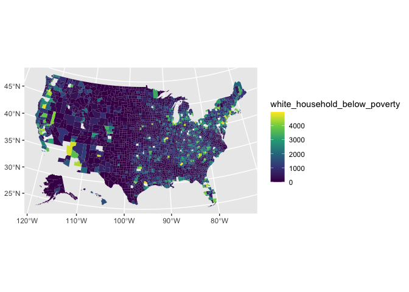

poor white people live everywhere; not just appalachia
================
2020-03-17

``` r
# Libraries
library(tidyverse)
library(tidycensus)

# Parameters

# Variable: household income in past 12 months below poverty level;
# white, not hispanic or latino

vars <- 
  c(
    "white_household_below_poverty" = "B17010H_002"
  )

#===============================================================================

# Code
```

Where are the majority of white households living below the poverty
line?

``` r
all_counties <- 
  get_acs(
    geography = "county",
    variables = vars,
    year = 2018
  ) %>%
  pivot_wider(names_from = variable, values_from = estimate) %>%
  transmute(
    fips = as.integer(GEOID), 
    name = NAME, 
    white_household_below_poverty
  )
```

    ## Getting data from the 2014-2018 5-year ACS

``` r
all_counties %>%
  arrange(desc(white_household_below_poverty))
```

    ## # A tibble: 3,220 x 3
    ##     fips name                           white_household_below_poverty
    ##    <int> <chr>                                                  <dbl>
    ##  1  6037 Los Angeles County, California                         35794
    ##  2  4013 Maricopa County, Arizona                               34868
    ##  3 36047 Kings County, New York                                 26595
    ##  4 17031 Cook County, Illinois                                  24378
    ##  5 26163 Wayne County, Michigan                                 22709
    ##  6  6073 San Diego County, California                           19234
    ##  7 48201 Harris County, Texas                                   16271
    ##  8  6065 Riverside County, California                           14267
    ##  9  6059 Orange County, California                              14211
    ## 10 32003 Clark County, Nevada                                   14141
    ## # … with 3,210 more rows

``` r
all_counties_geo <-
  ussf::boundaries(geography = "county") %>%
  mutate("fips" = as.integer(GEOID)) %>%
  left_join(all_counties, by = "fips") 
  
  
 all_counties_geo %>% 
  filter(white_household_below_poverty < 5000) %>%
  ggplot(aes(fill = white_household_below_poverty, geometry = geometry)) +
  geom_sf(size = 0.01) +
  scale_fill_viridis_c()
```

<!-- -->

``` r
# tried doing dot density plot... wasn't very effective
# dens_whp <-  
#   all_counties_geo %>%
#   mutate(
#     area = (st_area(geometry) %>% 
#       units::set_units(miles^2) %>%
#       as.numeric()),
#     dens = white_household_below_poverty / area
#   )
# 
# 
# dens_whp %>%
#   select(fips, name, dens, white_household_below_poverty, area) %>%
#   arrange(desc(dens))
#   
```

2.  When news organizations and political pundits want a picture of
    white poverty, they should go to Appalachia.

<!-- end list -->

  - Use ACS data to show that there are more poor white people living in
    suburbs and urban areas than there are in rural areas (or something
    like that)
  - (Cite also: folks like JD Vance and Charles Murray who use words
    like “Appalachians”, “Appalachian whites”, and “the white working
    class”.)

NOTE: \* Can do raw number of white people living below poverty line \*
Can do population density for certain populations; for instance, number
of white people living below the poverty line per square mile – USSF
package gives you back square land miles; did this in the spatial
visualization reading; can then take the number and divide by that\!
(aland variable)
