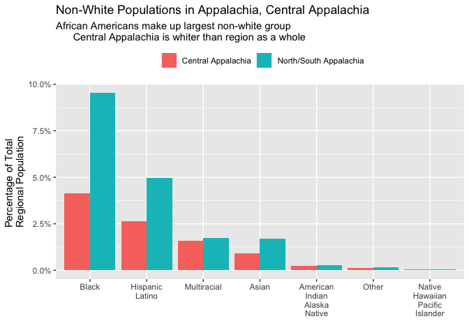
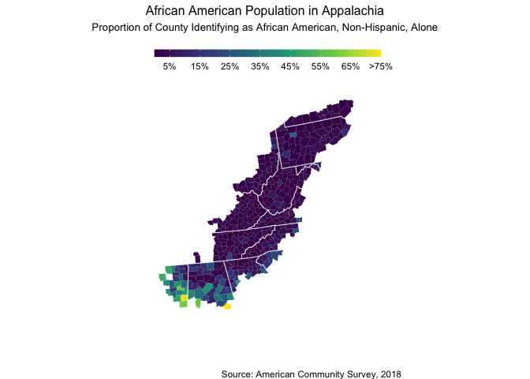
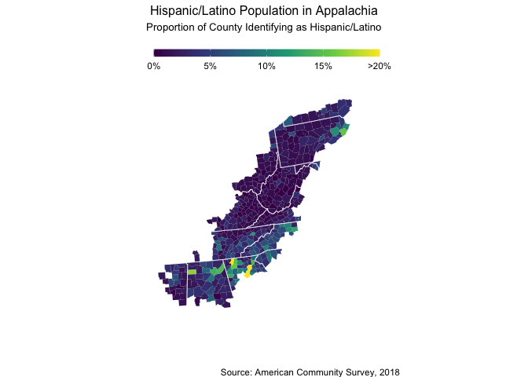
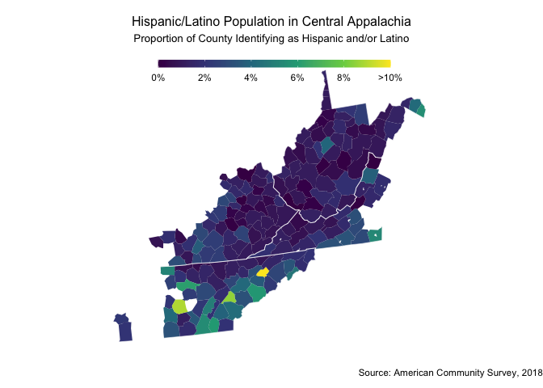
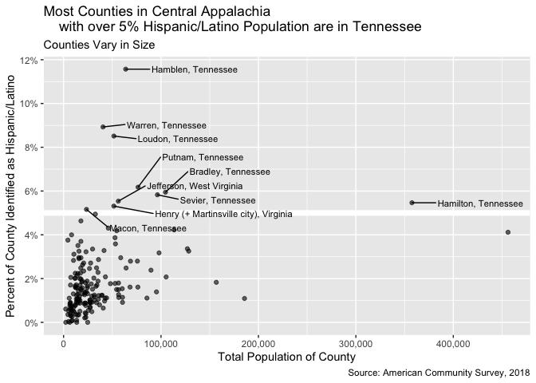
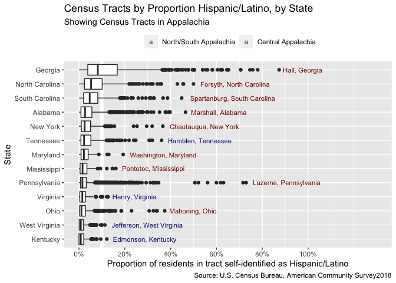
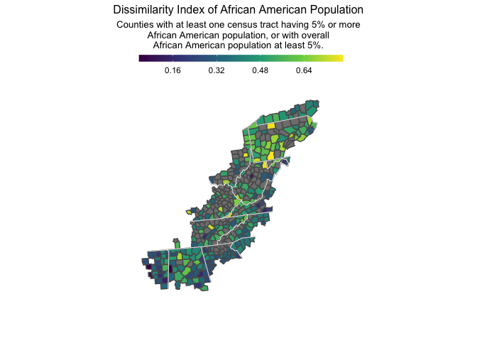
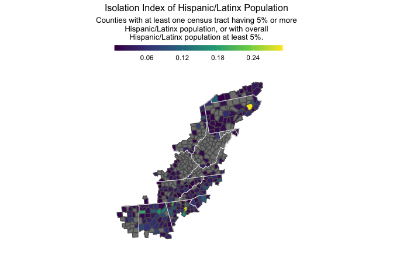

Final report
================
Thea Rossman
2020-03-17

## Introduction

My learning goal with this challenge was to build my comfort working
with census data. I used the tidycensus package to analyze estimates
from the 5-year American Community Survey (ACS-5) and values from the
Decennial Census – identifying patterns, making comparisons, and
identifying potential stories.

Below, I offer some numbers representing race, segregation, and
population demographics in the Appalachian region and the Central
Appalachian subregion.

## Defining Appalachia

I defined Appalachia according to the boundaries set by the Appalachian
Regional Commission, available on the ARC website.\[1\] I defined
Central Appalachia according to boundaries set by the Appalachian
Community Fund.\[2\]

The code to write the list of counties are in the `scripts` folder, as
`write_full_appalachia_counties.R` and
`write_central_appalachia_counties.R`.

I used these FIPS codes to filter data for my analysis.

``` r
app_counties_race <- 
  app_counties_race_file %>%
  read_csv(
    col_types = 
      cols(
        county_name = col_character(),
        state_name = col_character(),
        .default = col_integer()
      )
  )

cent_app_counties_race <- 
  cent_app_counties_race_file %>%
  read_csv(
    col_types = 
      cols(
        county_name = col_character(),
        state_name = col_character(),
        .default = col_integer()
      )
  )

cent_app_county_fips <- cent_app_counties_race %>% pull(fips)
app_county_fips <- app_counties_race %>% pull(fips)
```

There are 420 counties in this definition of Appalachia, and 185 in
Central Appalachia. As of 2018, the total population of Appalachia is
25,461,623, and the population of Central Appalachia is 6,522,964.

``` r
app_counties_race %>%
  select(fips) %>%
  mutate(
    subregion = 
      if_else(fips %in% cent_app_county_fips, 2, 1)
  ) %>%
  full_join(
    ussf::boundaries(geography = "county") %>% 
      transmute(fips = as.integer(GEOID), geometry) %>%
      filter(),
    by = "fips"
  ) %>%
  filter(!(fips %/% 1000 %in% alaska_hawaii)) %>%
  ggplot(aes(fill = subregion, geometry = geometry)) +
  geom_sf(size = 0.1) + 
  geom_sf(
    data = ussf::boundaries(geography = "state") %>%
      transmute(fips = as.integer(GEOID), geometry),
    color = "white", 
    fill = NA, 
    size = 0.2
  ) + 
  scale_fill_gradientn(
    colors = RColorBrewer::brewer.pal(n = 3, name = "Spectral"),
    na.value = "light grey"
  ) +
  theme_void() + 
  guides(fill = "none") + 
  labs(
    title = "Map Showing Appalachia, Central Appalachia",
    caption = "Boundaries from: Appalachian Regional Commission; Appalachian Community Fund"
  )
```

<!-- -->

## Race, population, and people of color in Appalachia: Demographics

Before digging into contemporary demographics, a historical note is
important. The white racial majority that exists in Appalachia today
should be understood as the result of centuries-long policies and
practices. Colonization, land grants, and the Indian Removal Act
decimated Shawnee, Cherokee, Monacan, Seneca, Haudenosaunee, and other
societies. Often the first fired and with little union protection,
millions of African Americans left Appalachia during migration waves.
When the Ku Klux Klan was at its height, many Black families lost
property, and terrorism forced others to flee. Many mixed-race people
worked to become legally classified as “white” to avoid the full brunt
of postbellum Jim Crow.\[3\]

``` r
app_counties_race <- 
  app_counties_race %>%
  mutate(n_nonwhite = total_population - white)

cent_app_counties_race <- 
  cent_app_counties_race %>%
  mutate(n_nonwhite = total_population - white)

n_nonwhite_app <-
  app_counties_race %>%
  pull(n_nonwhite) %>%
  sum()

n_nonwhite_cent_app <- 
  cent_app_counties_race %>%
  pull(n_nonwhite) %>%
  sum()

prop_nonwhite_app <- 
  app_counties_race %>%
  summarize(prop_nonwhite = sum(n_nonwhite) / sum(total_population))

prop_nonwhite_cent_app <- 
  cent_app_counties_race %>%
  summarize(prop_nonwhite = sum(n_nonwhite) / sum(total_population))
```

In 2018, there were approximately 4,676,028 people of color living in
Appalachia, and 629,627 people of color living in Central Appalachia.
This translates to 18.4% and 9.7% of the regional populations,
respectively.

``` r
app_counties_race %>%
  pivot_longer(
    cols = c(hispanic_latino, white:multiracial),
    names_to = "race_ethn",
    values_to = "pop"
  ) %>%
  mutate(subregion = "North/South Appalachia") %>%
  bind_rows(
    cent_app_counties_race %>%
      pivot_longer(
        cols = c(hispanic_latino, white:multiracial),
        names_to = "race_ethn",
        values_to = "pop"
      ) %>%
      mutate(subregion = "Central Appalachia")
  ) %>%
  group_by(race_ethn, subregion) %>%
  summarize(
    prop_of_pop = sum(pop) / sum(total_population)
  ) %>%
  filter(race_ethn != "white") %>%
  ggplot(
    aes(
      fct_reorder(race_ethn, -prop_of_pop), 
      prop_of_pop, 
      fill = subregion
    )
  ) + 
  geom_col(position = "dodge") +
  scale_x_discrete(
    labels = function(x) str_replace_all(x, "_", "\n") %>% str_to_title()
  ) +
  scale_y_continuous(labels = scales::label_percent()) +
  theme(
    legend.position = "top", 
    legend.direction = "horizontal"
  ) +
  labs(
    title = "Non-White Populations in Appalachia, Central Appalachia",
    subtitle = "African Americans make up largest non-white group
      Central Appalachia is whiter than region as a whole",
    x = "",
    y = "Percentage of Total \nRegional Population",
    fill = ""
  )
```

<!-- -->

## Geographic Distribution of African American Population in Appalachia

### By county and subregion

The difference in African American population between Appalachia and
Central Appalachia can be explained by the concentration of
majority-African American counties in Southern-most Appalachia,
particularly in Georgia and Alabama:

``` r
app_counties_race_geo <- 
  app_counties_race %>%
  left_join(
    (ussf::boundaries("county", projection = "albers") %>% 
       transmute(fips = as.integer(GEOID), geometry)),
    by = "fips"
  )

label_pct <- function(x, pct) {
  if_else(
    x < pct, 
    str_c(as.character(x*100), "%"), 
    str_c(">", as.character(pct*100), "%")
  )
}

state_boundaries <- 
  ussf::boundaries("state", projection = "albers") %>%
  filter(as.integer(GEOID) %in% (app_county_fips %/% 1000))

app_counties_race_geo %>%
  mutate(prop_black = pmin(black / total_population, 0.75)) %>%
  ggplot() +
  geom_sf(
    aes(fill = prop_black, geometry = geometry), 
    size = 0.01
  ) +
  geom_sf(data = state_boundaries, color = "white", fill = NA, size = 0.2) +
  scale_fill_viridis_c(
    breaks = seq(0.05, 0.75, 0.1),
    labels = function(x) label_pct(x, 0.75)
  ) +
  guides(
    fill =
      guide_colorbar(
        barheight = 0.5,
        barwidth = 15,
        title = NULL
      )
  ) +
  theme_void() +
  theme(
    legend.direction = "horizontal",
    legend.position = c(0.5, 0.95),
    plot.title = element_text(size = 12, hjust = 0.5),
    plot.subtitle = element_text(size = 10, hjust = 0.5)
  ) +
  labs(
    title = "African American Population in Appalachia",
    subtitle = "Proportion of County Identifying as African American, Non-Hispanic, Alone\n",
    caption = str_glue("Source: American Community Survey, ", acs5_year)
  )
```

<!-- -->

Several counties in Alabama and Mississippi are majority-Black:

``` r
app_counties_race_b <- 
  app_counties_race %>%
  mutate(prop_black = black / total_population) %>%
  select(county_name, state_name, prop_black, total_population, black) %>%
  arrange(desc(prop_black)) %>%
  filter(prop_black > 0.5)

app_counties_race_b %>%
  knitr::kable()
```

| county\_name | state\_name | prop\_black | total\_population | black |
| :----------- | :---------- | ----------: | ----------------: | ----: |
| Macon        | Alabama     |   0.8178335 |             19054 | 15583 |
| Noxubee      | Mississippi |   0.7222017 |             10828 |  7820 |
| Kemper       | Mississippi |   0.6090828 |             10107 |  6156 |
| Clay         | Mississippi |   0.5953655 |             19808 | 11793 |
| Hale         | Alabama     |   0.5872909 |             14887 |  8743 |

In central Appalachia, there are 3 counties with Black populations over
10%:

``` r
cent_app_counties_race_b <- 
  cent_app_counties_race %>%
  mutate(prop_black = black / total_population) %>%
  select(county_name, state_name, prop_black, total_population, black) %>%
  arrange(desc(prop_black)) %>%
  filter(prop_black > 0.1)

cent_app_counties_race_b %>%
  knitr::kable()
```

| county\_name                | state\_name   | prop\_black | total\_population | black |
| :-------------------------- | :------------ | ----------: | ----------------: | ----: |
| Henry (+ Martinsville city) | Virginia      |   0.2179964 |             51588 | 11246 |
| Hamilton                    | Tennessee     |   0.1915642 |            357546 | 68493 |
| Gilmer                      | West Virginia |   0.1096892 |              8205 |   900 |

There are 5 counties in Appalachia, all in Alabama and Mississippi, with
Black-alone populations over 50%, and 5, with one in Georgia, with
African American populations over 40%. These 5 counties include a total
of 50,095 individuals, or around 2.1% of the African American population
in the Appalachian region as a whole.

When we restrict our attention to Central Appalachia alone, there are
only 3 counties with African-American-alone populations over 10%, with a
maximum proportion of 21.8%.

To map the distribution of the Black population of Central Appalachia,
we shift our definition to include individuals who identified as African
American in combination with some other race(s):

``` r
cent_app_counties_race_geo_b <- 
  app_counties_race_geo %>%
  filter(fips %in% cent_app_county_fips) %>%
  left_join(
    get_acs(
      geography = "county",
      year = acs5_year,
      variables = c(black_alone_or_in_comb = "B02009_001")
    ) %>%
      transmute(fips = as.integer(GEOID), name = NAME, variable, estimate) %>%
      pivot_wider(names_from = variable, values_from = estimate),
    by = "fips"
  ) %>%
  mutate(
    prop_black = black_alone_or_in_comb / total_population
  )
```

    ## Getting data from the 2014-2018 5-year ACS

``` r
cent_app_counties_race_geo_b %>%
  mutate(prop_black = pmin(prop_black, 0.15)) %>%
  ggplot() +
  geom_sf(
    aes(fill = prop_black, geometry = geometry), 
    size = 0.01
  ) +
  geom_sf(
    data = state_boundaries %>% 
      filter(as.integer(GEOID) %in% (cent_app_county_fips %/% 1000)), 
    color = "white", 
    fill = NA, 
    size = 0.2
  ) +
  scale_fill_viridis_c(
    breaks = seq(.01, 0.15, 0.02),
    labels = function(x) label_pct(x, 0.15)
  ) +
  guides(
    fill =
      guide_colorbar(
        barheight = 0.5,
        barwidth = 15,
        title = NULL
      )
  ) +
  theme_void() +
  theme(
    legend.direction = "horizontal",
    legend.position = c(0.5, 0.95),
    plot.title = element_text(size = 12, hjust = 0.5),
    plot.subtitle = element_text(size = 10, hjust = 0.5)
  ) +
  labs(
    title = "African American Population in Central Appalachia",
    subtitle = "Proportion of County Identifying as African American, Non-Hispanic
    Alone or in Combination with Other Races\n",
    caption = str_glue("Source: American Community Survey, ", acs5_year)
  )
```

<!-- -->

As is clear from the map, there are some counties in Central Appalachia
with virtually no Black population:

``` r
cent_app_counties_race_geo_b %>%
  mutate(
    name = str_c(county_name, " County, ", state_name)
  ) %>%
  select(name, prop_black, total_population, black_alone_or_in_comb) %>%
  arrange(desc(prop_black)) %>% 
  filter(prop_black < 0.0025) %>%
  arrange(prop_black) %>%
  knitr::kable()
```

| name                          | prop\_black | total\_population | black\_alone\_or\_in\_comb |
| :---------------------------- | ----------: | ----------------: | -------------------------: |
| Highland County, Virginia     |   0.0000000 |              2214 |                          0 |
| Clay County, West Virginia    |   0.0001138 |              8785 |                          1 |
| Magoffin County, Kentucky     |   0.0003948 |             12666 |                          5 |
| Jackson County, Kentucky      |   0.0009721 |             13373 |                         13 |
| Webster County, West Virginia |   0.0010566 |              8518 |                          9 |
| Menifee County, Kentucky      |   0.0014052 |              6405 |                          9 |
| Calhoun County, West Virginia |   0.0016225 |              7396 |                         12 |

Some counties in Central Appalachia with relatively high Black
populations are located in metropolitan areas, such as Knox County,
Tennessee (Knoxville), Hamilton County, Tennessee (Chattanooga), and
Kanawha County, West Virginia (Charleston). However, others are located
in smaller counties, such as Henry County/Martinsville City, VA, and
Jefferson County, WV.

``` r
cent_app_counties_race_geo_b %>%
  mutate(name = str_c(county_name, " County, ", state_name)) %>%
  ggplot(aes(prop_black, total_population)) + 
  geom_point() +
  ggrepel::geom_text_repel(
    aes(label = name),
    data =
      . %>%
      mutate(name = map_chr(name, str_replace, " County", "")) %>%
      filter(prop_black > 0.075),
    size = 3,
    direction = "y",
    hjust = -0.3,
    vjust = 0.2
  ) +
  scale_x_continuous(labels = scales::label_percent()) +
  scale_y_continuous(labels = scales::label_comma()) +
  labs(
    title = "Central Appalachian Black Population Spread Across Counties of All Sizes",
    subtitle = "Individuals who self-identified as Black/African American Alone
    or in combination with other races",
    x = "Percent of Residents Self-Identified as Black/African American
    Alone or in Combination with Other Races",
    y = "Total Population of County",
    caption = 
      str_glue(
        "Source: American Community Survey, ", 
        acs5_year
      )
  )
```

<!-- -->

The graph above may be somewhat misleading.

The county in West Virginia with the highest African American population
is Gilmer County. Initially, this was surprising to me (I’ve been to
Gilmer County). I then realized that Gilmer County is home to a federal
prison, located in Glenville, which, according to a Google search, has
an incarcerated population of approximately 1,730 people.

When I tried retrieving data for the variables on the census that
correspond to institutionalized populations, I found that values are
suppressed (or there is a bug in the Census API):

``` r
gilmer_imprisoned_population <-
  get_acs(
    geography = "county",
    year = acs5_year,
    variables = 
      c(
        institutionalized_pop = "B26101_067",
        institutionalized_pop_black = "B26103B_003",
        institutionalized_pop_multiracial = "B26103F_007"
      ),
    state = "West Virginia",
    county = "Gilmer"
  )
```

    ## Getting data from the 2014-2018 5-year ACS

``` r
gilmer_imprisoned_population
```

    ## # A tibble: 3 x 5
    ##   GEOID NAME                       variable                       estimate   moe
    ##   <chr> <chr>                      <chr>                             <dbl> <dbl>
    ## 1 54021 Gilmer County, West Virgi… institutionalized_pop                NA    NA
    ## 2 54021 Gilmer County, West Virgi… institutionalized_pop_black          NA    NA
    ## 3 54021 Gilmer County, West Virgi… institutionalized_pop_multira…       NA    NA

Despite lack of data, my hypothesis from online research is that
**Gilmer County is overwhelmingly white, but the imprisoned population
living there is majority-Black**.\[4\]

McDowell County, WV and Raligh County, WV are also home to federal
prisons, and may show a similar trend. However, **more data would be
needed to determine this for certain.**

In rural areas, including Central Appalachia, the incarceration industry
has been sold as a solution to economic decline. More data is needed to
determine how this is changing the landscape of Appalachia.\[5\]

### By census tract

I also conducted EDA and retreived census data at census tract, block
groups, and block geographies. I found that there exist census tracts in
Appalachia with extremely high Black populations, which is information
that we lose at the county level.

``` r
census_tracts_race <- 
  census_tracts_file %>%
  read_csv(
    col_types = 
      cols(
        fips = col_character(), 
        name = col_character(),
        prop_nonwhite = col_double(), 
        .default = col_integer()
      )
  ) %>%
  mutate(prop_black = black / total_population)
```

In the Appalachian region as a whole, there are many census tracts in
Alabama and Pennsylvania that are estimated to be nearly 100% Black.

Note that Allegheny County is in the Pittsburgh area; Jefferson County
contains Birmingham; and the University of Alabama is located in
Tuscaloosa County. Macon County contains Tuskegee, but is not in a major
metropolitan area.

``` r
census_tracts_race %>%
  select(name, total_population, black, prop_black) %>%
  filter(prop_black > .95) %>%
  arrange(desc(prop_black)) %>%
  knitr::kable()
```

| name                                             | total\_population | black | prop\_black |
| :----------------------------------------------- | ----------------: | ----: | ----------: |
| Census Tract 33, Jefferson County, Alabama       |               969 |   969 |   1.0000000 |
| Census Tract 511, Allegheny County, Pennsylvania |               170 |   170 |   1.0000000 |
| Census Tract 29, Jefferson County, Alabama       |              1960 |  1947 |   0.9933673 |
| Census Tract 2319, Macon County, Alabama         |              1355 |  1340 |   0.9889299 |
| Census Tract 118, Tuscaloosa County, Alabama     |              3194 |  3157 |   0.9884158 |
| Census Tract 117.03, Tuscaloosa County, Alabama  |              4962 |  4884 |   0.9842805 |
| Census Tract 2321, Macon County, Alabama         |              1387 |  1364 |   0.9834174 |
| Census Tract 57.01, Jefferson County, Alabama    |              2462 |  2414 |   0.9805037 |
| Census Tract 130.02, Jefferson County, Alabama   |              1640 |  1605 |   0.9786585 |
| Census Tract 11, Jefferson County, Alabama       |              4897 |  4787 |   0.9775373 |
| Census Tract 51.01, Jefferson County, Alabama    |              1802 |  1757 |   0.9750277 |
| Census Tract 5, Jefferson County, Alabama        |              2977 |  2902 |   0.9748069 |
| Census Tract 2323, Macon County, Alabama         |              1364 |  1328 |   0.9736070 |
| Census Tract 7, Jefferson County, Alabama        |              2744 |  2669 |   0.9726676 |
| Census Tract 8, Jefferson County, Alabama        |              3097 |  3009 |   0.9715854 |
| Census Tract 12, Jefferson County, Alabama       |              2619 |  2538 |   0.9690722 |
| Census Tract 31, Jefferson County, Alabama       |              4053 |  3924 |   0.9681717 |
| Census Tract 38.02, Jefferson County, Alabama    |              5149 |  4976 |   0.9664012 |
| Census Tract 52, Jefferson County, Alabama       |              3690 |  3564 |   0.9658537 |
| Census Tract 2318, Macon County, Alabama         |               935 |   900 |   0.9625668 |
| Census Tract 509, Allegheny County, Pennsylvania |              1292 |  1243 |   0.9620743 |
| Census Tract 2316.02, Macon County, Alabama      |              1547 |  1481 |   0.9573368 |
| Census Tract 131, Jefferson County, Alabama      |              4210 |  4026 |   0.9562945 |
| Census Tract 2317, Macon County, Alabama         |              2498 |  2387 |   0.9555645 |

In central Appalachia, the counties containing Chattanooga (Hamilton)
and Knoxville (Knox) contained census tracks over 75% Black:

``` r
census_tracts_race %>%
  filter(county_fips %in% cent_app_county_fips) %>%
  select(name, total_population, black, prop_black) %>%
  top_n(10, wt = prop_black) %>%
  arrange(desc(prop_black)) %>%
  knitr::kable()
```

| name                                            | total\_population | black | prop\_black |
| :---------------------------------------------- | ----------------: | ----: | ----------: |
| Census Tract 122, Hamilton County, Tennessee    |              2257 |  2068 |   0.9162605 |
| Census Tract 4, Hamilton County, Tennessee      |              3760 |  3424 |   0.9106383 |
| Census Tract 19, Hamilton County, Tennessee     |              3792 |  3413 |   0.9000527 |
| Census Tract 16, Hamilton County, Tennessee     |              2623 |  2263 |   0.8627526 |
| Census Tract 114.44, Hamilton County, Tennessee |              3259 |  2764 |   0.8481129 |
| Census Tract 12, Hamilton County, Tennessee     |              3231 |  2629 |   0.8136800 |
| Census Tract 32, Hamilton County, Tennessee     |              3090 |  2340 |   0.7572816 |
| Census Tract 20, Knox County, Tennessee         |              3091 |  2256 |   0.7298609 |
| Census Tract 33, Hamilton County, Tennessee     |              6162 |  4444 |   0.7211944 |
| Census Tract 19, Knox County, Tennessee         |              1440 |   941 |   0.6534722 |

Looking closer at census tracts in Central Appalachia with more than a
quarter African American population, we see a relationship between
county size and the existence of a census tract with a relatively large
Black population:

``` r
census_tracts_race %>%
  filter(county_fips %in% cent_app_county_fips) %>%
  drop_na(total_population, prop_black) %>%
  group_by(county_fips) %>%
  mutate(total_pop_county = sum(total_population)) %>%
  ggplot(aes(total_pop_county, prop_nonwhite)) +
  geom_point(alpha = 0.6) +
  ggrepel::geom_text_repel(
    aes(
      label = name %>% 
        str_remove("Census Tract") %>%
        str_remove("County") %>%
        str_remove_all("[:digit:]") %>%
        str_remove_all(",") %>%
        str_remove_all("\\.") %>%
        str_trim() %>%
        str_replace(" ", ",")
    ),
    data = 
      . %>% 
      filter(prop_nonwhite > 0.4) %>%
      distinct(county_fips, .keep_all = TRUE),
    size = 3,
    direction = "both",
    vjust = 0.1,
    hjust = -0.3
  ) +
  scale_x_continuous(labels = scales::label_comma()) +
  scale_y_continuous(
    breaks = scales::breaks_width(0.2),
    labels = scales::label_percent()
  ) +
  labs(
    title = "Many, but not all, Majority-Black Census Tracts in Central Appalachia 
    are in Large Counties",
    subtitle = "Labelled counties contain tracts with >40% Black population",
    y = "Prop. self-identified as \nAfrican American, Non-Hispanic Alone",
    x = "Total Population of County",
    caption = 
      str_glue(
        "Source: U.S. Census Bureau, American Community Survey, ",
        acs5_year
      )
  )
```

<!-- -->

We also note that one county can show significant range in the African
American population of its census tracts.

## Distribution of Hispanic/Latino Population

### By county

Though the counties with the largest Hispanic/Latino proportion,
relatively, are clustered in Southern Appalachia, they are clustered in
the eastern part of the region, rather than, as with the
majority-African American counties, the western part.

``` r
app_counties_race_geo %>%
  mutate(
    prop_hisp_latino = pmin(hispanic_latino / total_population, 0.2)
  ) %>%
  ggplot() +
  geom_sf(
    aes(fill = prop_hisp_latino, geometry = geometry), 
    size = 0.01
  ) +
  geom_sf(data = state_boundaries, color = "white", fill = NA, size = 0.2) +
  scale_fill_viridis_c(
    breaks = seq(0, 0.2, 0.05),
    labels = function(x) label_pct(x, pct = 0.2)
  ) +
  guides(
    fill =
      guide_colorbar(
        barheight = 0.5,
        barwidth = 15,
        title = NULL
      )
  ) +
  theme_void() +
  theme(
    legend.direction = "horizontal",
    legend.position = c(0.5, 0.95),
    plot.title = element_text(size = 12, hjust = 0.5),
    plot.subtitle = element_text(size = 10, hjust = 0.5)
  ) +
  labs(
    title = "Hispanic/Latino Population in Appalachia",
    subtitle = "Proportion of County Identifying as Hispanic/Latino\n",
    caption = str_glue("Source: American Community Survey, ", acs5_year)
  )
```

<!-- -->

``` r
app_counties_race_geo %>%
  filter(fips %in% cent_app_county_fips) %>%
  mutate(
    prop_hisp_latino = pmin(hispanic_latino / total_population, 0.1)
  ) %>%
  ggplot() +
  geom_sf(
    aes(fill = prop_hisp_latino, geometry = geometry), 
    size = 0.01
  ) +
  geom_sf(
    data = state_boundaries %>% 
      filter(as.integer(GEOID) %in% (cent_app_county_fips %/% 1000)), 
    color = "white", 
    fill = NA, 
    size = 0.2
  ) +
  scale_fill_viridis_c(
    breaks = seq(0, 0.1, 0.02),
    labels = function(x) label_pct(x, 0.1)
  ) +
  guides(
    fill =
      guide_colorbar(
        barheight = 0.5,
        barwidth = 15,
        title = NULL
      )
  ) +
  theme_void() +
  theme(
    legend.direction = "horizontal",
    legend.position = c(0.5, 0.95),
    plot.title = element_text(size = 12, hjust = 0.5),
    plot.subtitle = element_text(size = 10, hjust = 0.5)
  ) +
  labs(
    title = "Hispanic/Latino Population in Central Appalachia",
    subtitle = "Proportion of County Identifying as Hispanic and/or Latino\n",
    caption = str_glue("Source: American Community Survey, ", acs5_year)
  )
```

<!-- -->

``` r
app_counties_race %>%
  filter(fips %in% cent_app_county_fips) %>%
  mutate(prop_hisp_latino = hispanic_latino / total_population) %>%
  ggplot(aes(total_population, prop_hisp_latino)) +
  geom_hline(yintercept = 0.05, color = "white", size = 2.5) +
  geom_point(alpha = 0.6) +
  ggrepel::geom_text_repel(
    aes(label = name),
    data =
      . %>%
      mutate(name = str_c(county_name, ", ", state_name)) %>%
      filter(prop_hisp_latino > 0.05),
    size = 3,
    direction = "y",
    hjust = -0.3,
    min.segment.length = 0.1
  ) +
  scale_x_continuous(labels = scales::label_comma()) +
  scale_y_continuous(
    breaks = seq(0, .12, .02),
    labels = scales::label_percent(accuracy = 1)
  ) +
  labs(
    title = "Most Counties in Central Appalachia 
    with over 5% Hispanic/Latino Population are in Tennessee",
    subtitle = "Counties Vary in Size",
    x = "Total Population of County",
    y = "Percent of County Identified as Hispanic/Latino",
    caption = str_glue("Source: American Community Survey, ", acs5_year)
  )
```

<!-- -->

With the exception of Jefferson, WV – in the eastern panhandle of WV,
bordering Washington, DC – and Henry, Virginia – in the southernmost
part of central/western Virginia, bordering North Carolina – all
counties with more than 5% Hispanic/Latino population are in Tennessee.

### By census tract

There are a few counties in Georgia and Pennsylvania with census tracts
that have a majority Hispanic/Latino population:

``` r
census_tracts_race <- 
  census_tracts_race %>%
  mutate(prop_hisp_latino = hispanic_latino / total_population)

census_tracts_race %>%
  select(name, prop_hisp_latino, total_population) %>%
  filter(prop_hisp_latino > 0.5) %>%
  arrange(desc(prop_hisp_latino)) %>%
  knitr::kable()
```

| name                                            | prop\_hisp\_latino | total\_population |
| :---------------------------------------------- | -----------------: | ----------------: |
| Census Tract 11.01, Hall County, Georgia        |          0.8735150 |              5724 |
| Census Tract 10.03, Hall County, Georgia        |          0.7801321 |              8023 |
| Census Tract 11.02, Hall County, Georgia        |          0.7583236 |              4295 |
| Census Tract 10, Whitfield County, Georgia      |          0.7462429 |              4059 |
| Census Tract 2175, Luzerne County, Pennsylvania |          0.7295810 |              2363 |
| Census Tract 2172, Luzerne County, Pennsylvania |          0.7162247 |              3168 |
| Census Tract 13, Whitfield County, Georgia      |          0.7061821 |              4513 |
| Census Tract 504.34, Gwinnett County, Georgia   |          0.7056139 |              8764 |
| Census Tract 504.22, Gwinnett County, Georgia   |          0.6525265 |              8015 |
| Census Tract 4, Whitfield County, Georgia       |          0.6492603 |              7909 |
| Census Tract 504.17, Gwinnett County, Georgia   |          0.6454756 |              6056 |
| Census Tract 2177, Luzerne County, Pennsylvania |          0.6309627 |              4612 |
| Census Tract 503.19, Gwinnett County, Georgia   |          0.6254758 |              6830 |
| Census Tract 505.24, Gwinnett County, Georgia   |          0.6188780 |              6738 |
| Census Tract 504.18, Gwinnett County, Georgia   |          0.6187627 |              7355 |
| Census Tract 2178, Luzerne County, Pennsylvania |          0.6183735 |              3320 |
| Census Tract 503.06, Gwinnett County, Georgia   |          0.6048110 |              3492 |
| Census Tract 2176, Luzerne County, Pennsylvania |          0.5999413 |              3407 |
| Census Tract 504.24, Gwinnett County, Georgia   |          0.5829630 |              8100 |
| Census Tract 12, Whitfield County, Georgia      |          0.5816340 |              7405 |
| Census Tract 2179, Luzerne County, Pennsylvania |          0.5613879 |              4496 |
| Census Tract 7.02, Hall County, Georgia         |          0.5613053 |              5179 |
| Census Tract 12.01, Hall County, Georgia        |          0.5542460 |              7042 |
| Census Tract 12.02, Hall County, Georgia        |          0.5404691 |              6054 |
| Census Tract 503.20, Gwinnett County, Georgia   |          0.5397959 |              5880 |
| Census Tract 2171, Luzerne County, Pennsylvania |          0.5216672 |              3023 |
| Census Tract 2011, Luzerne County, Pennsylvania |          0.5065835 |              1443 |
| Census Tract 2174, Luzerne County, Pennsylvania |          0.5057915 |              1554 |
| Census Tract 505.26, Gwinnett County, Georgia   |          0.5039872 |              4389 |
| Census Tract 503.04, Gwinnett County, Georgia   |          0.5024370 |              4924 |
| Census Tract 10.02, Hall County, Georgia        |          0.5005242 |              7630 |

Restricting to Central Appalachia, we see that the census tracts with
the ten largest proportion of Hispanic/Latino residents are all in
Tennessee, from a total of 6 different counties:

``` r
census_tracts_race %>%
  filter(county_fips %in% cent_app_county_fips) %>%
  arrange(desc(prop_hisp_latino)) %>%
  select(name, prop_hisp_latino, total_population) %>%
  top_n(10, prop_hisp_latino) %>%
  knitr::kable()
```

| name                                           | prop\_hisp\_latino | total\_population |
| :--------------------------------------------- | -----------------: | ----------------: |
| Census Tract 1003, Hamblen County, Tennessee   |          0.3607056 |              3288 |
| Census Tract 24, Hamilton County, Tennessee    |          0.3203587 |              5575 |
| Census Tract 23, Hamilton County, Tennessee    |          0.3110014 |              1418 |
| Census Tract 26, Hamilton County, Tennessee    |          0.3061041 |              2228 |
| Census Tract 1001, Hamblen County, Tennessee   |          0.2479527 |              6594 |
| Census Tract 114.02, Bradley County, Tennessee |          0.2454136 |              2889 |
| Census Tract 808.01, Sevier County, Tennessee  |          0.2391590 |              3044 |
| Census Tract 1004, Hamblen County, Tennessee   |          0.2185919 |              6917 |
| Census Tract 606, Loudon County, Tennessee     |          0.2018876 |              4874 |
| Census Tract 1, Putnam County, Tennessee       |          0.1873079 |              5531 |

``` r
app_state_fips <-
  app_counties_race %>%
  transmute(
    state_fips = fips %/% 1000,
    state_name
  ) %>%
  distinct(state_fips, state_name)

census_tracts_race %>%
  mutate(state_fips = county_fips %/% 1000) %>%
  left_join(app_state_fips, by = "state_fips") %>%
  drop_na(state_fips, prop_hisp_latino) %>%
  ggplot(aes(fct_reorder(state_name, prop_hisp_latino), prop_hisp_latino)) +
  geom_hline(yintercept = 0.1, color = "white", size = 2) +
  geom_boxplot() +
  scale_y_continuous(
    breaks = seq(0, 1, 0.2),
    labels = scales::label_percent(),
    limits = c(0, 1.3)
  ) +
  geom_text(
    aes(
      label = name %>% 
        str_remove("Census Tract") %>%
        str_remove("County") %>%
        str_remove_all("[:digit:]") %>%
        str_remove_all(",") %>%
        str_remove_all("\\.") %>%
        str_trim() %>%
        str_replace(" ", ","),
      color = central_app
    ),
    data = 
      . %>% 
      group_by(state_name) %>%
      top_n(1, wt = prop_hisp_latino) %>%
      mutate(central_app = (county_fips %in% cent_app_county_fips)),
    size = 3,
    hjust = -0.1
  ) + 
  coord_flip() +
  scale_color_manual(
    values = c("#8b0000", "#00008b"),
    breaks = c(FALSE, TRUE),
    labels = c("North/South Appalachia", "Central Appalachia")
  ) +
  theme(
    legend.position = "top", 
    legend.direction = "horizontal",
    legend.title = element_blank()
  ) +
  labs(
    title = "Census Tracts by Proportion Hispanic/Latino, by State",
    subtitle = "Showing Census Tracts in Appalachia",
    x = "State",
    y = "Proportion of residents in tract self-identified as Hispanic/Latino",
    caption = 
      str_glue(
        "Source: U.S. Census Bureau, American Community Survey", 
        acs5_year
      )
  )
```

<!-- -->

Note that there are counties in every state in Appalachia with at least
one census track having over 10% Hispanic/Latino population.

## Approximate Residential Segregation of African American, Hispanic Populations in Appalachia

The analysis above gives a sense of segregation between counties, as
well as some sense that there is significant segregation between census
tracts, within a single county.

The analysis below uses Census tracts to approximate how segregated
African American and Hispanic populations are in Appalachia, in the
counties within which a significant population of them exists.\[6\]

For the purposes of this analysis, “significant” will mean that either
the county population is at least 5% made up of the group, or contains
at least one census tract that is.

(In my EDA, I performed similar analysis using census blocks (decennial
census) and block groups. In this report, I am only including
segregation metrics calculated via census tracts.\[7\])

I use two measures to quantify racial segregation\[8\]: the isolation
index and the dissimilarity index. These are imperfect measurements and
should be taken as heuristics only, but they are widely used in
sociological literature.

The isolation index is calculated as:

\(\frac{  \sum_{i=1}^n \left( \frac{AA_i}{AA_{total}} \cdot \frac{AA_i}{persions_i} \right)  - \frac{AA_{total}}{persons_{total}}}{1 - \frac{AA_{total}}{persons_{total}}}\)

Where \(AA_i\) is the number of African Americans in tract i;
\(AA_{total}\) is the number of African Americans in the county as a
whole; \(persons_i\) denotes total population in tract i.

The isolation index measures the extent to which African American
residents are exposed primarily to one another, calculated through the
scaled and normalized proportion of the city area inhabited by the
average African American. A higher index (closer to 1) indicates higher
isolation.

And the dissimilarity index is calculated as:

\(\frac{1}{2} \sum_{i=1}^N \mid {\frac{AA_i}{AA_{total}} - \frac{AA_i^c}{AA_{total}^c}} \mid\)

This formula uses the same notation as above; additionally, \(AA_i^c\)
is the number of non African Americans in tract i, and \(AA_{total}^c\)
is the number of non African Americans in the city.

Dissimilarity measures whether a group is more likely to live in some
areas vs. others. If African Americans disproportionately reside in some
areas (census tracts) of a county relative to non-African Americans, the
dissimilarity index between the two groups is high.

(The indices for the Hispanic/Latino population are calculated
equivalently.)

These indices are most useful for comparing across places.

``` r
segregation_indices <- 
  segregation_indices_file %>%
  read_csv(
    col_types = 
      cols(
        county_name = col_character(),
        state_name = col_character(),
        aa_dissimilarity_index = col_double(),
        hl_dissimilarity_index = col_double(),
        na_dissimilarity_index = col_double(),
        aa_isolation_index = col_double(),
        hl_isolation_index = col_double(),
        na_isolation_index = col_double(), 
        .default = col_integer()
      )
  )

segregation_indices_pivoted <- 
  segregation_indices_file_pivoted %>%
  read_csv(
    col_types = 
      cols(
        county_name = col_character(),
        state_name = col_character(),
        index_name = col_character(),
        race_ethn = col_character(),
        index_value = col_double(),
        pop_group = col_double(),
        prop_of_population = col_double(),
        .default = col_integer()
      )
  )
```

Below, the indices for each groups are mapped onto Appalachian counties.
A few notes from this:

  - First, the counties for which this report does and does not quantify
    segregation. For each group, these are counties that do not meet the
    criteria of “significance” defined above.
      - (In thinking about segregation in the entire Appalachian region,
        we must also think about segregation between counties, which is
        somewhat discussed above.)
  - Second, though the comparison between the two indices is not
    absolute, we can heuristically tell that the dissimilarity indices
    for both groups are much higher than the isolation indices.
      - This suggests that both Latino and African American Appalachians
        are much more likely to live in some tracts than others within a
        county, but are likely to live in tracts with groups of other
        races.
  - Finally, though there are outliers and some geographic pattern, it
    is nowhere near as striking as the differences in proportional
    populations between counties explored above.

<!-- end list -->

``` r
counties_segregation_geo <- 
  segregation_indices %>%
  left_join(
    ussf::boundaries(geography = "county") %>%
      transmute(county_fips = as.integer(GEOID), geometry),
    by = "county_fips"
  )


plot_segregation <- function(tibble, group, index) {
  breakwidth <- 
    ((tibble %>% pull(index) %>% max(na.rm = TRUE))/5) %>% round(digits = 2)
  tibble %>%
    ggplot(aes(geometry = geometry, fill = index)) + 
    geom_sf() + 
    geom_sf(data = state_boundaries, color = "white", fill = NA, size = 0.2) +
    scale_fill_viridis_c(
      breaks = scales::breaks_width(breakwidth)
    ) +
    guides(
      fill =
        guide_colorbar(
          barheight = 0.5,
          barwidth = 15,
          title = NULL
        )
    ) +
    theme_void() +
    theme(
      legend.direction = "horizontal",
      legend.position = c(0.5, 0.95),
      plot.title = element_text(size = 12, hjust = 0.5),
      plot.subtitle = element_text(size = 10, hjust = 0.5)
    ) +
    labs(
      title = str_glue(index, " of ", group, " Population"),
      subtitle = 
        str_glue("Counties with at least one census tract having ", 
                 prop*100,
                 "% or more\n",
                 group, 
                 " population, or with overall\n", 
                 group, 
                 " population at least ", 
                 prop*100, 
                 "%."
        )
    )
}

plot_segregation(
  counties_segregation_geo %>% 
    select(
      index = aa_dissimilarity_index,
      geometry
    ),
  group = "African American",
  index = "Dissimilarity Index"
)
```

<!-- -->

``` r
plot_segregation(
  counties_segregation_geo %>% 
    select(
      index = hl_dissimilarity_index,
      geometry
    ),
  group = "Hispanic/Latinx",
  index = "Dissimilarity Index"
)
```

<!-- -->

``` r
plot_segregation(
  counties_segregation_geo %>% 
    select(
      index = aa_isolation_index,
      geometry
    ),
  group = "African American",
  index = "Isolation Index"
)
```

<!-- -->

``` r
plot_segregation(
  counties_segregation_geo %>% 
    select(
      index = hl_isolation_index,
      geometry
    ),
  group = "Hispanic/Latinx",
  index = "Isolation Index"
)
```

<!-- -->

``` r
segregation_indices_pivoted %>%
  filter(race_ethn != "nativeam", prop_of_population > 0.05) %>%
  ggplot(aes(index_value, color = fct_reorder(race_ethn, index_value))) +
  geom_density() +
  facet_grid(cols = vars(index_name)) +
  scale_color_discrete(
    breaks = c("hisplatino", "black"),
    labels = c("Hispanic/\nLatinx", "African American")) + 
  theme(legend.position = "top") +
  labs(
    title = "Measures of Segregation in Appalachia",
    subtitle = "Hispanic/Latino Population Smaller, Less Segregated (by Census Tract)
    Showing Counties Where Group Population Exceeds 5%", 
    x = "Index Value (1 indicates higher segregation)",
    y = "Density (Number of Counties)",
    color = "",
    caption = 
      str_glue(
        "Source: American Community Survey, ",
        acs5_year, 
        "\nSegregation Indices Calculated by Census Tract"
      )
  )
```

<!-- -->

It is also worth noting that Hispanic Appalachians are less segregated,
by both measures, than African American Appalachians. This may be due to
in their relative sizes and/or different, historically rooted
experiences of systemic racism in the region.

``` r
segregation_indices_pivoted %>%
  filter(race_ethn == "black") %>%
  ggplot(aes(index_value, color = index_name)) + 
  geom_density() +
  facet_wrap(vars(state_name)) +
  theme(legend.position = "top") +
  labs(
    title = "African American Population: Patterns of Segregation Vary by State",
    subtitle = 
      str_glue(
        "Segregation Indices Calculated For Counties With >",
        as.character(prop*100),
        "% African American/Black, Non-Hispanic, alone population,
        or with at least one census tract having >",
        as.character(prop*100),
        "% African American/Black, Non-Hispanic, alone population."
      ),
    x = "Calculated Index for the County (1 = more segregated)",
    y = "Number of Counties", 
    color = ""
  )
```

<!-- -->

``` r
segregation_indices_pivoted %>%
  filter(race_ethn == "hisplatino", state_name != "Maryland") %>%
  ggplot(aes(index_value, color = index_name)) + 
  geom_density() +
  facet_wrap(vars(state_name)) +
  theme(legend.position = "top") +
  labs(
    title = "Hispanic/Latino Population: Patterns of Segregation Vary by State",
    subtitle = 
      str_glue(
        "Segregation Indices Calculated For Counties With >",
        as.character(prop*100),
        "% Hispanic/Latino population,
        or with at least one census tract having >",
        as.character(prop*100),
        "% Hispanic/Latino population."
      ),
    x = "Calculated Index for the County (1 = more segregated)",
    y = "Number of Counties",
    color = "",
    caption = str_glue("Source: American Community Survey, ", acs5_year)
  )
```

<!-- -->

Finally, we note that patterns of segregation vary by state (recall that
for each state plot, these are only the counties with “significant”
populations of Black and/or Hispanic/Latino residents).

For instance – West Virginia has more highly (\>0.5 index) dissimilar
counties than Appalachian parts of Georgia, but the two rank similarly
in terms of isolation.

## Conclusion

While many counties and census tracts in Appalachia remain
majority-white, there are counties and neighborhoods with significant,
and even majority, Black, Hispanic/Latino, Indigenous, and/or Native
populations. Unlike at a national scaele, Black people make up the
majority of the non-white population in both Appalachia as a whole and
Central Appalachia. While some areas in Appalachia are relatively
integrated, many remain segregated, both within and between counties and
states. Hispanic and Latino Appalachians, due perhaps to their relative
size and different experiences of historical racism, tend to be more
residentially integrated than Black Appalachians.

The American Community Survey data is abundant and useful, and it offers
imperfect but effective estimates for our communities at neighborhood,
county, regional, and national scales. There is so much more to do with
this dataset\!\!\!

1.  A map of the Appalachian region is available on the [ARC
    website](https://www.arc.gov/images/appregion/AppalachianRegionCountiesMap.pdf).
    To access FIPS codes, I used supplementary data tables from a study
    of county economic status, which is available for download
    [here](https://www.arc.gov/appalachian_region/CountyEconomicStatusandDistressedAreasinAppalachia.asp).

2.  Counties are listed and mapped
    [here](http://www.appalachiancommunityfund.org/where-we-fund/).

3.  {A few of many possible sources for this include: *Blacks in
    Appalachia*, ed. William H. Turner and Edward J. Cabbell (Lexington,
    KY: University Press of Kentucky, 1985; Anita Puckett, “The
    Melungeon Identity Movement and the Construction of Appalachian
    Whiteness,” Journal of Linguistic Anthropology 11, no. 1 (June
    2001)}

4.  Lynette Monroe describes Gilmer County and its federal prison in a
    piece for *Blavity*: “Visiting My Boyfriend In A Federal Prison Led
    Me To Realize Just How Much Black Bodies Are Used As A Solution To
    Economic Decline,” July 19 2018.
    <https://blavity.com/visiting-my-boyfriend-in-a-federal-prison-led-me-to-realize-just-how-much-black-bodies-are-used-as-a-solution-to-economic-decline?category1=community-submitted>

5.  Links to articles and resources on this: [New
    Republic](https://newrepublic.com/article/155660/appalachia-coal-mining-mountaintop-removal-prison-fight);
    [WV
    Public](https://www.wvpublic.org/post/phantom-promise-how-appalachia-was-sold-prisons-economic-lifeline#stream/0);
    [Appalachian Prison Book
    Project](https://appalachianprisonbookproject.org);
    [Truthout](https://truthout.org/articles/land-of-extraction-how-prison-industry-settled-in-central-appalachia/);
    [Appalachian Fellows’
    Blog](http://www.appfellows.org/appfellows-blog/2018/9/6/land-reform-cant-happen-without-the-abolishing-the-prison-industrial-complex-by-lill-prosperino).

6.  This [study](https://www.census.gov/prod/2002pubs/censr-3.pdf) from
    the US Census Bureau uses tracts as the unit of analysis for
    measuring segregation in metropolitan areas. This
    [study](https://www.ncbi.nlm.nih.gov/pmc/articles/PMC5285374/) used
    similar measures for rural areas.

7.  Hispanic/Latino population numbers are suppressed for blocks and
    block groups, and census blocks are only available for the decennial
    census. However, I’m proud of the code I wrote for my EDA to get
    data for block groups – map\_dfr and functions are so cool\!

8.  The formulas for these indices come from this
    [source](https://ignaciomsarmiento.github.io/2017/03/24/Mapping-Segregation-in-Chicago.html),
    and are duplicated in the sources cited in footnote 8.
