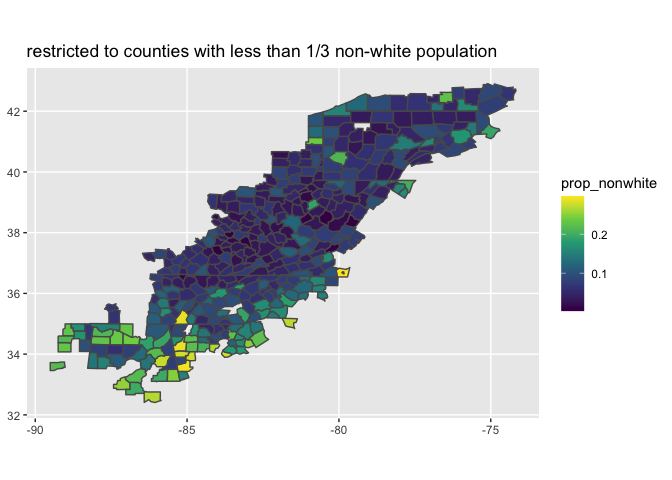
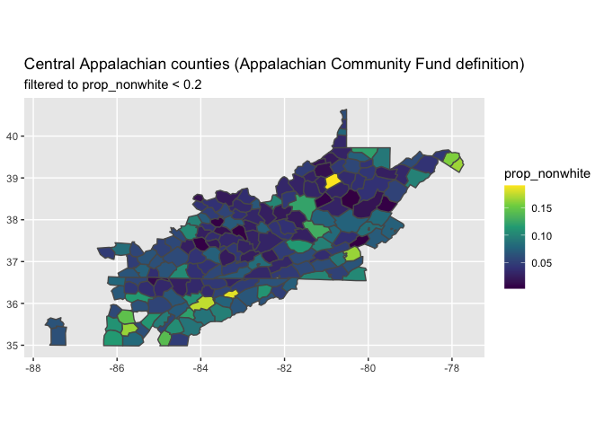

Race, Ethnicity, & Appalachian Peoples: Scaffolding Talk-Back with ACS
Data
================
Thea Rossman
2019-

  - [1. Background & motivation](#background-motivation)
  - [2. Where is Appalachia?](#where-is-appalachia)
  - [3. Background: race and ethnicity in Appalachian
    counties.](#background-race-and-ethnicity-in-appalachian-counties.)
  - [4. Get census data on race and ethnicity in
    Appalachia](#get-census-data-on-race-and-ethnicity-in-appalachia)
  - [5. Get census block data for race and ethnicity in Appalachian
    sub-counties](#get-census-block-data-for-race-and-ethnicity-in-appalachian-sub-counties)

``` r
# Libraries
library(tidyverse)
library(tidycensus)

# Parameters

ky_central_app_counties <- 
  c(
    "Adair", "Bath", "Bell", "Boyd", "Breathitt", "Carter", "Casey", "Clark", 
    "Clay", "Clinton", "Cumberland", "Edmonson", "Elliott", "Estill", "Fleming", 
    "Floyd", "Garrard", "Green", "Greenup", "Harlan", "Hart", "Jackson", 
    "Johnson", "Knott", "Knox", "Laurel", "Lawrence", "Lee", "Leslie", 
    "Letcher", "Lewis", "Lincoln", "McCreary", "Madison", "Magoffin", "Martin", 
    "Menifee", "Metcalfe", "Monroe", "Montgomery", "Morgan", "Nicholas", 
    "Owsley", "Perry", "Pike", "Powell", "Pulaski", "Robertson", "Rockcastle", 
    "Rowan", "Russell", "Wayne", "Whitley",  "Wolfe"
  )

tn_central_app_counties <-
  c(
    "Anderson", "Bledsoe", "Blount", "Bradley", "Campbell", "Cannon", "Carter", 
    "Claiborne", "Clay", "Cocke", "Coffee", "Cumberland", "De Kalb", "Fentress", 
    "Franklin", "Grainger", "Greene", "Grundy", "Hamblen", "Hamilton", 
    "Hancock", "Hawkins", "Jackson", "Jefferson", "Johnson", "Knox", "Lawrence", 
    "Lewis", "Loudon", "McMinn", "Macon", "Marion", "Meigs", "Monroe", "Morgan", 
    "Overton", "Pickett", "Polk", "Putnam", "Rhea", "Roane", "Scott", 
    "Sequatchie", "Sevier", "Smith", "Sullivan", "Unicoi", "Union", "Van Buren", 
    "Warren", "Washington", "White"
  )

va_central_app_counties <- 
  c(
    "Alleghany", "Bath", "Bland", "Botetourt", "Buchanan", "Carroll", 
    "Craig", "Dickenson", "Floyd", "Giles", "Grayson", "Henry", "Highland", 
    "Lee", "Montgomery", "Patrick", "Pulaski", "Rockbridge", "Russell", 
    "Scott", "Smyth", "Tazewell", "Washington", "Wise", "Norton", "Wythe"
  )

# note that all counties in WV are in the ARC def of Central Appalachia

# ACS5 call parameters
  # race and ethnicity; using "Hispanic or Latino Origin by Race" variable
race_ethnicity_vars_acs5 <- 
  c(
    white = "B03002_003",
    black = "B03002_004",
    american_indian_alaska_native = "B03002_005",
    asian = "B03002_006",
    native_hawaiian_pacific_islander = "B03002_007",
    other = "B03002_008",
    multiracial = "B03002_009",
    hispanic_latino = "B03001_003",
    total_population = "B03002_001"
  )
  # year of interest
acs5_year <- 2018

# Decennial census call parameters
  # race and ethnicity; using "Hispanic or Latino Origin by Race" variable
race_ethnicity_vars_dec <- 
  c(
    total_pop = "P005001",
    white_alone = "P005003",
    black_alone = "P005004",
    amer_ind_alask_nativ_alone = "P005005",
    asian_alone = "P005006",
    nat_hawaiian_pac_island_alone = "P005007",
    other_alone = "P005008",
    multi_racial = "P005009",
    hisp_latino = "P004003"
  )
  
dec_year <- 2010


# white households living below poverty line
white_household_poverty_acs5 <- 
  c(
    n_households = "B17010_001",
    n_white_households = "B17010H_001",
    white_households_below_poverty = "B17010H_002"
  )


# solution begin

  # file containing FIPS codes for ARC-designated counties
arc_counties_file <- "~/Downloads/County-Economic-Status_FY2020_Data.xlsx"

  # files containing FIPS codes from Census bureau
fips_all_geocodes_file <- "~/Downloads/all-geocodes-v2018.xlsx"
fips_state_file <- "~/Downloads/state-geocodes-v2018.xlsx"

# solution end

#===============================================================================

# Code
```

## 1\. Background & motivation

Before beginning this challenge, read
[this](https://www.guernicamag.com/elizabeth-catte-appalachia-isnt-trump-country/)
interview with public historian Elizabeth Catte and
[this](https://www.thestayproject.net/blog-stay-in-the-news/stays-full-statement-re-jd-vance-at-the-2018-appalachian-studies-conference)
statement from the Stay Together Appalachian Youth (STAY) project.

Both of the pieces above reference the book *Hillbilly Elegy* by J.D.
Vance. Vance has joined a long line of journalists, writers, social
scientists (in particular, statisticians), politicians, and aid workers
who have, since the 1880s, presented a singular, exaggerated narrative
of the peoples living in the central and southern Appalachian mountains.
The narratives about Appalachia that the above authors reference have,
depsite historical changes, remained relatively static.

This challenge emerges from the ways in which census data, including the
American Community Survey, has been used to both perpetuate these
narratives about Appalachia and, by folks in the region, to buttress
personal stories in speaking back against them.

Two major ways that the former has happened, and how it shows up in
*Hillbilly Elegy*:

  - In referring to the nebulous population which he claims his
    experience represents, J.D. Vance uses the descriptors “Appalachian
    whites,” “the white working-class,” “poor whites,” “rural whites,”
    and “Appalachians” interchangeably. This collapsing of identities –
    assuming that working-class and poor white people live primarily in
    Appalachia, and that everyone in Appalachia is poor/working-class
    and white – is hardly unique to Vance and hardly new. It erases the
    experiences of people of color currently in the region, people of
    color with ancestral ties to the region, and the majority of poor
    and working-class white people (who live elsewhere).
  - J.D. Vance joins up with others (including white supremacist
    statistician Charles Murray, whom Elizabeth Catte references in her
    interview above) who draw on ACS and other data (e.g., two-parent
    home, marriage and divorce, religious practice) to scaffold a
    “culture of poverty” argument – e.g., the claim that individuals,
    not systems, are responsible for personal economic conditions.

One relatively simple tactic that people within the region have used to
push back is analyzing and citing census data that contradict bullet
point \#1.

**q1.1** Find at least two claims from the articles or paragraph above
that you imagine someone could be skeptical of and that you believe you
could help back up with data.

There are a lot of possible responses to this question. A few that stick
out to me:

  - From Catte:
      - “…just the sheer ratio of Trump Country pieces. We have to
        question why there are so many articles about Appalachia and
        Trump, and so few articles about progressive people in
        Appalachia.”
      - “The working class of Appalachia is the working class of any
        region. It’s people who work in retail and hospitality. People
        who work in healthcare and are underpaid for that. People who
        are teachers and educators, who, again, are very underpaid. The
        working class are the people just like in California, who are
        trapped in what we call the gig economy. People who are trapped
        in unstable work contracts, temp labor, people who work at the
        Dollar General store. People who give you your flu shot. These
        are the people in Appalachia who make the region tick. Also, the
        emerging face of the working class is more likely to be a woman
        or a person of color.”
  - From STAY:
      - “Bringing JD Vance in as an ‘expert’ on that panel legitimized
        his narrative and marginalized, erased and silenced the
        experiences and voices of young people, people of color,
        indigenous people, people who are poor, people with
        disabilities, and LGBTQIA+ people in Appalachia.”

## 2\. Where is Appalachia?

Before we begin to pull data from the census, we need to define and get
FIPS codes for a workable geographic region.

I suggest basing your analysis on two different definitions of
Appalachia.

**q2.1** The first is from the [Appalachian Regional
Commission](https://www.arc.gov/appalachian_region/CountiesinAppalachia.asp).
This is the most common definition used. It comes from the 1960s War on
Poverty era. (borders are cultural and historical artifacts.)

You are going to be making maps and pulling census data, so you need
FIPS codes. On the ARC website, you will be able to find reports and
studies, some of which provide maps. These allow you to download
supporting data as an Excel file. These files include data for counties,
which include county FIPS codes. (Hint: I used a “County Economic Status
in Appalachia” study.)

Download one of these files, import the data, and create a tibble with
the FIPS code, county name, and state name. Call this
`all_appalachia_counties`.

``` r
# solution begin

all_appalachian_counties <- 
  arc_counties_file %>%
  readxl::read_xlsx(
    sheet = "ARC Counties", 
    skip = 4
  ) %>%
  transmute(
    fips = as.integer(FIPS), 
    county_name = County, 
    state_name = State
  ) %>%
  drop_na()
```

    ## Warning: NAs introduced by coercion

``` r
# solution end
```

**q2.2** The second is from the [Appalachian Community
Fund](http://www.appalachiancommunityfund.org/where-we-fund/). These
counties represent one boundary definition of “Central Appalachia.”

The county names from this webpage are in the parameters, divided by
state (note that all WV counties are on the list, so they are not in the
parameters). Create a tibble similar to `all_appalachia_counties` called
`central_appalachia_counties`.

I did this by getting FIPS codes from the census for all counties; then
filtering this by state and by a vector of county names; then binding
the rows of these tibbles together. (If there’s a faster way of doing
it, please do that\!)

``` r
# solution begin

# get all geocodes from census bureau website in order to filter to Central App
state_fips <- 
  fips_state_file %>%
  readxl::read_xlsx(skip = 5) %>%
  transmute(
    state_fips = as.integer(`State (FIPS)`),
    name = Name
  ) %>%
  filter(state_fips != 0)

all_US_fips <- 
  fips_all_geocodes_file %>%
  readxl::read_xlsx(skip = 4) %>%
  transmute(
    summary_level = as.integer(`Summary Level`),
    state_code = as.integer(`State Code (FIPS)`),
    county_code = as.integer(`County Code (FIPS)`),
    full_county_fips = state_code*1000 + county_code,
    county_subdivision_code = as.integer(`County Subdivision Code (FIPS)`),
    place_code = as.integer(`Place Code (FIPS)`),
    consolidated_city_code = as.integer(`Consolidtated City Code (FIPS)`),
    area_name = 
      `Area Name (including legal/statistical area description)`
  )


# create a function that returns tibble of county fips for each state
# (recall that for WV, all counties are included)
central_app_countynames <- 
  tribble(
    ~ state, ~ counties,
    "Kentucky", ky_central_app_counties,
    "Tennessee", tn_central_app_counties,
    "Virginia", va_central_app_counties
  )

get_countyfips <- function(statename, counties) {
  all_US_fips %>%
  filter(
    state_code %in% 
      (state_fips %>% filter(name == statename) %>% pull(state_fips))
  ) %>%
  mutate(county_name = map_chr(area_name, word)) %>%
  filter(
    county_name %in% counties, 
    place_code == 0
  ) %>%
  transmute(
    fips = full_county_fips,
    county_name = area_name,
    state_name = statename
  )
}

wv_counties <- 
  all_US_fips %>%
  filter(
    state_code == 
      (state_fips %>% filter(name == "West Virginia") %>% pull(state_fips)),
    place_code == 0,
    county_code != 0
  ) %>%
  transmute(
    fips = full_county_fips,
    county_name = area_name,
    state_name = "West Virginia"
  )
# check that there are 55 counties in WV tibble, as there should be
nrow(wv_counties) == 55
```

    ## [1] TRUE

``` r
central_appalachia_counties <- 
  central_app_countynames %>% 
  pmap_dfr(~ get_countyfips(..1, ..2)) %>%
  bind_rows(wv_counties) 

# solution end
```

## 3\. Background: race and ethnicity in Appalachian counties.

Skim and/or read through
[this](https://www.npr.org/sections/codeswitch/2014/04/03/298892382/stereotypes-of-appalachia-obscure-a-diverse-picture),
[this](https://www.thestayproject.net/what-is-stay.html),
[this](http://appvoices.org/2019/06/07/contending-with-contamination-in-minden-w-va/),
[this](https://www.hollerhealthjustice.org),
[this](https://www.thenation.com/article/archive/seeing-appalachia-through-the-eyes-of-appalachians/),
and
[this](https://www.facebook.com/highlandercenter/posts/2399172926781803).
Optional – skim “We play Billie Holiday at the abortion clinic,” by
Alice; in the last pages of the STAY project zine
[here](https://www.thestayproject.net/uploads/7/5/6/0/75605377/appalachian_love_story_zine.pdf)

A note: As Barbara Ellen Smith (among others) has noted, the
contemporary white majority in Appalachia should be taken not as “a
benign demographic fact,” but as “a product of active practices
characterized in part by persistent white supremacy.” Think about
colonization, land theft, and American Indian Removal policies;
discrimination in jobs and housing that made it harder for Black
families to stay; racial terrorism that forced some non-white people to
flee; and the challenges of living under Jim Crow that pushed many who
could to pass as white.

**q3.1** From the articles above, what are some things that stick out to
you?

Again, many possible responses to this question.

Some possible bullet points:

  - History of Appalachia as a destination for (white) poverty tourism
      - I find it helpful to point out where this causes harm: erasure
        of people of color (there’s no single story of Appalachia),
        hiding structural factors for economic and health-related
        realities, justifying labor and resource extraction, and falsely
        projecting economic conditions as unique to a single region
  - History of the reality of a multiracial Appalachia, including
    systemic and interpersonal racism in the region
      - Indigenous history and present in Appalachia (especially
        Shawnee, Monacan Nation, and Eastern Band of Cherokee Indians);
      - African-Americans are region’s largest minority;
      - Growing and existing Latino population
  - Many examples of strong community networks, grassroots groups, and
    progressive advocacy organizations who are building and fighting for
    progressive change in Appalachia. The STAY Project, Minden community
    action, Holler Health Justice, and the Highlander Center are
    examples of this.

LOTS of things to say about data that are referenced in the articles
above. Two things that I’m thinking about, in particular:

  - One reason that Minden community had such a hard time accessing EPA
    relocation funds is due to a lack or intentional masking of data
    that made it look like not a “cancer cluster,” or that blamed high
    rates of cancer on individuals’ health choices.  
  - The Code Switch article also mentions transitory workers,
    undocumented people, and under-documented people, who may be
    uncounted or undercounted by the census. This calls into question
    the accuracy of using ACS data.

## 4\. Get census data on race and ethnicity in Appalachia

**q4.1** Use tidycensus to get statistics on race and ethnicity and
estimates for total population for the Appalachian regions defined
above.

Some notes: For this, I used the ACS5 for 2018; Sara said that it’s
pretty accurate, and the most recent decennial census was almost 10
years ago. I considered “white” to mean “white alone, non-Hispanic.” I
chose variables for race that distinguish from Hispanic and/or Latinx
origin, and I did not break down American Indian/Alaska Native
populations by tribal citizenship.

``` r
# solution begin

get_race_ethnicity <- function(statename, counties_df) {
  get_acs(
    geography = "county", 
    variables = race_ethnicity_vars_acs5,
    year = acs5_year,
    state = statename,
    county = 
      {{counties_df}} %>% 
      filter(state_name == statename) %>%
      mutate(fips = fips %% 1000) %>%
      pull(fips)
  ) %>%
  transmute(
    fips = as.integer(GEOID),
    variable,
    estimate
  ) %>%
  pivot_wider(names_from = variable, values_from = estimate) %>%
  left_join(all_appalachian_counties, by = "fips") %>%
  select(fips, county_name, state_name, everything())
}

# for ARC-defined appalachia
race_all_appalachia <- 
  all_appalachian_counties %>%
  select(statename = state_name) %>%
  distinct() %>%
  pmap_dfr(~ get_race_ethnicity(..1, all_appalachian_counties))
```

    ## Getting data from the 2014-2018 5-year ACS
    ## Getting data from the 2014-2018 5-year ACS
    ## Getting data from the 2014-2018 5-year ACS
    ## Getting data from the 2014-2018 5-year ACS
    ## Getting data from the 2014-2018 5-year ACS
    ## Getting data from the 2014-2018 5-year ACS
    ## Getting data from the 2014-2018 5-year ACS
    ## Getting data from the 2014-2018 5-year ACS
    ## Getting data from the 2014-2018 5-year ACS
    ## Getting data from the 2014-2018 5-year ACS
    ## Getting data from the 2014-2018 5-year ACS
    ## Getting data from the 2014-2018 5-year ACS
    ## Getting data from the 2014-2018 5-year ACS

``` r
# for ACF-defined appalachia
race_central_appalachia <-
  central_appalachia_counties %>%
  select(statename = state_name) %>%
  distinct %>%
  pmap_dfr(~ get_race_ethnicity(..1, central_appalachia_counties))
```

    ## Getting data from the 2014-2018 5-year ACS
    ## Getting data from the 2014-2018 5-year ACS
    ## Getting data from the 2014-2018 5-year ACS
    ## Getting data from the 2014-2018 5-year ACS

``` r
# solution end
```

**q4.2** Explore the data a bit. In doing this, I found it helpful to
create a “prop\_white” variable.

  - Check out which counties have the largest white and non-white
    populations. Check out averages and medians.
  - Check out how non-white residents self-identified on the census. If
    you want, pull additional data on ethnicity for the census for
    specific counties.
  - Maybe check out absolute numbers. What do you notice? One question
    that was interesting to me: in the perception that Appalachia is
    white, approximately how many people are being erased?
  - Other ideas?

Note: many different possible ways to do this\!\! Below is just an
example.

``` r
# solution begin

# create variables
race_all_appalachia <- 
  race_all_appalachia %>%
  mutate(
    n_nonwhite = total_population - white,
    prop_nonwhite = n_nonwhite / total_population
  )


# SUMMARY

# Alabama, Georgia, and Mississippi include counties with highest 
# non-white proportion; some of these have majority-people of color populations
race_all_appalachia %>%
  arrange(desc(prop_nonwhite))
```

    ## # A tibble: 420 x 14
    ##     fips county_name state_name hispanic_latino total_population  white  black
    ##    <int> <chr>       <chr>                <dbl>            <dbl>  <dbl>  <dbl>
    ##  1  1087 Macon       Alabama                328            19054   2972  15583
    ##  2 28103 Noxubee     Mississip…             148            10828   2799   7820
    ##  3 28069 Kemper      Mississip…             132            10107   3439   6156
    ##  4 13135 Gwinnett    Georgia             188608           902298 345876 239090
    ##  5 28025 Clay        Mississip…             137            19808   7722  11793
    ##  6  1065 Hale        Alabama                130            14887   5898   8743
    ##  7 13097 Douglas     Georgia              13371           141840  59484  63998
    ##  8 28107 Panola      Mississip…             693            34243  16095  17021
    ##  9 28093 Marshall    Mississip…            1281            35787  17068  17118
    ## 10 28017 Chickasaw   Mississip…             815            17279   8627   7505
    ## # … with 410 more rows, and 7 more variables:
    ## #   american_indian_alaska_native <dbl>, asian <dbl>,
    ## #   native_hawaiian_pacific_islander <dbl>, other <dbl>, multiracial <dbl>,
    ## #   n_nonwhite <dbl>, prop_nonwhite <dbl>

``` r
# These are followed by some counties in NC, PA, SC, VA, TN, and OH
# none of these counties are majority-POC 
race_all_appalachia %>%
  filter(!(state_name %in% c("Alabama", "Georgia", "Mississippi"))) %>%
  arrange(desc(prop_nonwhite))
```

    ## # A tibble: 322 x 14
    ##     fips county_name state_name hispanic_latino total_population  white black
    ##    <int> <chr>       <chr>                <dbl>            <dbl>  <dbl> <dbl>
    ##  1 37067 Forsyth     North Car…           46913           371573 211844 95294
    ##  2 42053 Forest      Pennsylva…             466             7351   4518  2159
    ##  3 37173 Swain       North Car…             731            14254   8868    60
    ##  4 42089 Monroe      Pennsylva…           25830           167586 111965 22300
    ##  5 45083 Spartanburg South Car…           20137           302195 207276 61317
    ##  6 45045 Greenville  South Car…           44630           498402 342233 89068
    ##  7 51089 Henry (+ M… Virginia              2740            51588  36240 11246
    ##  8 47065 Hamilton    Tennessee            19538           357546 254697 68493
    ##  9 45021 Cherokee    South Car…            2392            56711  41353 11354
    ## 10 39099 Mahoning    Ohio                 13489           231064 175986 33736
    ## # … with 312 more rows, and 7 more variables:
    ## #   american_indian_alaska_native <dbl>, asian <dbl>,
    ## #   native_hawaiian_pacific_islander <dbl>, other <dbl>, multiracial <dbl>,
    ## #   n_nonwhite <dbl>, prop_nonwhite <dbl>

``` r
props_all_appalachia <- 
  race_all_appalachia %>%
  mutate(
    prop_poc_hispanic = hispanic_latino / n_nonwhite,
    prop_poc_black = black / n_nonwhite, 
    prop_poc_native = 
      (american_indian_alaska_native + native_hawaiian_pacific_islander) / 
        n_nonwhite,
    prop_poc_asian = asian / n_nonwhite,
    prop_poc_other = other / n_nonwhite,
    prop_poc_multiracial = multiracial / n_nonwhite
  )

# Here, we see many counties where nearly all non-white population is Black
# These counties are largely in Alabama and Mississippi
props_all_appalachia %>% 
  arrange(desc(prop_poc_black)) %>%
  select(
    county_name, 
    state_name, 
    prop_poc_black, 
    total_population, 
    prop_nonwhite
  )
```

    ## # A tibble: 420 x 5
    ##    county_name state_name  prop_poc_black total_population prop_nonwhite
    ##    <chr>       <chr>                <dbl>            <dbl>         <dbl>
    ##  1 Coosa       Alabama              0.985            10855         0.347
    ##  2 Clay        Mississippi          0.976            19808         0.610
    ##  3 Noxubee     Mississippi          0.974            10828         0.742
    ##  4 Hale        Alabama              0.973            14887         0.604
    ##  5 Macon       Alabama              0.969            19054         0.844
    ##  6 Choctaw     Mississippi          0.958             8321         0.325
    ##  7 Yalobusha   Mississippi          0.955            12421         0.419
    ##  8 Winston     Mississippi          0.953            18358         0.499
    ##  9 Panola      Mississippi          0.938            34243         0.530
    ## 10 Monroe      Mississippi          0.933            35840         0.330
    ## # … with 410 more rows

``` r
# This pattern is true for Hispanic/Latinx populations, but less extreme
props_all_appalachia %>% 
  arrange(desc(prop_poc_hispanic)) %>%
  select(
    county_name, 
    state_name, 
    prop_poc_hispanic,
    total_population,
    prop_nonwhite
  )
```

    ## # A tibble: 420 x 5
    ##    county_name state_name     prop_poc_hispanic total_population prop_nonwhite
    ##    <chr>       <chr>                      <dbl>            <dbl>         <dbl>
    ##  1 Murray      Georgia                    0.862            39557       0.171  
    ##  2 Whitfield   Georgia                    0.844           103849       0.409  
    ##  3 Magoffin    Kentucky                   0.836            12666       0.00434
    ##  4 Gilmer      Georgia                    0.822            29922       0.139  
    ##  5 Clinton     Kentucky                   0.751            10211       0.0377 
    ##  6 DeKalb      Alabama                    0.743            71200       0.193  
    ##  7 Calhoun     West Virginia              0.741             7396       0.0277 
    ##  8 Alleghany   North Carolina             0.740            10973       0.130  
    ##  9 Franklin    Alabama                    0.738            31542       0.229  
    ## 10 Marshall    Alabama                    0.726            95145       0.188  
    ## # … with 410 more rows

``` r
props_all_appalachia %>% 
  arrange(desc(prop_poc_native)) %>%
  select(
    county_name, 
    state_name, 
    prop_poc_native,
    total_population,
    prop_nonwhite
  )
```

    ## # A tibble: 420 x 5
    ##    county_name state_name     prop_poc_native total_population prop_nonwhite
    ##    <chr>       <chr>                    <dbl>            <dbl>         <dbl>
    ##  1 Graham      North Carolina           0.796             8557       0.132  
    ##  2 Swain       North Carolina           0.736            14254       0.378  
    ##  3 Green       Kentucky                 0.510            11023       0.0552 
    ##  4 Lewis       Kentucky                 0.497            13490       0.0218 
    ##  5 Clay        West Virginia            0.479             8785       0.00808
    ##  6 Rockcastle  Kentucky                 0.417            16827       0.0265 
    ##  7 Jackson     North Carolina           0.406            42256       0.191  
    ##  8 Cattaraugus New York                 0.315            77686       0.0935 
    ##  9 Jackson     West Virginia            0.287            29018       0.0295 
    ## 10 Wolfe       Kentucky                 0.286             7223       0.0145 
    ## # … with 410 more rows

``` r
# The counties with the largest proportion of 
# people who identify as multiracial are in counties with low (< 17%)
# non-white populations
props_all_appalachia %>%
  arrange(desc(prop_poc_multiracial)) %>%
  select(
    county_name, 
    state_name, 
    prop_poc_multiracial,
    total_population,
    prop_nonwhite
  )
```

    ## # A tibble: 420 x 5
    ##    county_name state_name    prop_poc_multiracial total_population prop_nonwhite
    ##    <chr>       <chr>                        <dbl>            <dbl>         <dbl>
    ##  1 Grundy      Tennessee                    0.812            13331       0.164  
    ##  2 Highland    Virginia                     0.727             2214       0.00497
    ##  3 Van Buren   Tennessee                    0.689             5704       0.0400 
    ##  4 Menifee     Kentucky                     0.667             6405       0.00562
    ##  5 Estill      Kentucky                     0.620            14313       0.0265 
    ##  6 Vinton      Ohio                         0.605            13111       0.0338 
    ##  7 Jackson     Kentucky                     0.582            13373       0.00501
    ##  8 Craig       Virginia                     0.571             5113       0.00411
    ##  9 Mason       West Virginia                0.564            26939       0.0324 
    ## 10 Pickens     Georgia                      0.562            30832       0.127  
    ## # … with 410 more rows

``` r
props_all_appalachia %>% 
  filter(prop_poc_multiracial > 0.3, prop_nonwhite > 0.17)
```

    ## # A tibble: 0 x 20
    ## # … with 20 variables: fips <int>, county_name <chr>, state_name <chr>,
    ## #   hispanic_latino <dbl>, total_population <dbl>, white <dbl>, black <dbl>,
    ## #   american_indian_alaska_native <dbl>, asian <dbl>,
    ## #   native_hawaiian_pacific_islander <dbl>, other <dbl>, multiracial <dbl>,
    ## #   n_nonwhite <dbl>, prop_nonwhite <dbl>, prop_poc_hispanic <dbl>,
    ## #   prop_poc_black <dbl>, prop_poc_native <dbl>, prop_poc_asian <dbl>,
    ## #   prop_poc_other <dbl>, prop_poc_multiracial <dbl>

``` r
# solution end
```

``` r
# solution begin

race_central_appalachia <- 
  race_central_appalachia %>%
  mutate(
    n_nonwhite = total_population - white,
    prop_nonwhite = n_nonwhite / total_population
  )

# total number of nonwhite people living in Central Appalachia in 2018
# (note that this is absolutely an under-estimate)

total_nonwhite <- 
  sum(race_central_appalachia %>% pull(n_nonwhite) %>% sum())

race_central_appalachia %>%
  summarize(
    mean_prop_nonwhite = mean(prop_nonwhite),
    median_prop_nonwhite = median(prop_nonwhite)
  )
```

    ## # A tibble: 1 x 2
    ##   mean_prop_nonwhite median_prop_nonwhite
    ##                <dbl>                <dbl>
    ## 1             0.0630               0.0544

``` r
race_central_appalachia %>%
  arrange(desc(n_nonwhite))
```

    ## # A tibble: 185 x 14
    ##     fips county_name state_name hispanic_latino total_population  white black
    ##    <int> <chr>       <chr>                <dbl>            <dbl>  <dbl> <dbl>
    ##  1 47065 Hamilton    Tennessee            19538           357546 254697 68493
    ##  2 47093 Knox        Tennessee            18777           456185 376585 39963
    ##  3 54039 Kanawha     West Virg…            2025           185710 163003 13336
    ##  4 54003 Berkeley    West Virg…            4795           113495  95601  8207
    ##  5 51121 Montgomery… Virginia              3110            97997  81916  4302
    ##  6 51089 Henry (+ M… Virginia              2740            51588  36240 11246
    ##  7 47011 Bradley     Tennessee             6217           104557  89794  4941
    ##  8 47179 Washington  Tennessee             4273           127055 112918  5084
    ##  9 54061 Monongalia  West Virg…            2182           105252  92582  3795
    ## 10 47063 Hamblen     Tennessee             7374            63740  52050  2227
    ## # … with 175 more rows, and 7 more variables:
    ## #   american_indian_alaska_native <dbl>, asian <dbl>,
    ## #   native_hawaiian_pacific_islander <dbl>, other <dbl>, multiracial <dbl>,
    ## #   n_nonwhite <dbl>, prop_nonwhite <dbl>

``` r
race_central_appalachia %>%
  arrange(desc(prop_nonwhite))
```

    ## # A tibble: 185 x 14
    ##     fips county_name state_name hispanic_latino total_population  white black
    ##    <int> <chr>       <chr>                <dbl>            <dbl>  <dbl> <dbl>
    ##  1 51089 Henry (+ M… Virginia              2740            51588  36240 11246
    ##  2 47065 Hamilton    Tennessee            19538           357546 254697 68493
    ##  3 54021 Gilmer      West Virg…             328             8205   6645   900
    ##  4 47063 Hamblen     Tennessee             7374            63740  52050  2227
    ##  5 47093 Knox        Tennessee            18777           456185 376585 39963
    ##  6 54037 Jefferson   West Virg…            3111            56179  46896  3524
    ##  7 51121 Montgomery… Virginia              3110            97997  81916  4302
    ##  8 47061 Grundy      Tennessee              164            13331  11150    89
    ##  9 54003 Berkeley    West Virg…            4795           113495  95601  8207
    ## 10 47177 Warren      Tennessee             3612            40454  34601   569
    ## # … with 175 more rows, and 7 more variables:
    ## #   american_indian_alaska_native <dbl>, asian <dbl>,
    ## #   native_hawaiian_pacific_islander <dbl>, other <dbl>, multiracial <dbl>,
    ## #   n_nonwhite <dbl>, prop_nonwhite <dbl>

``` r
# solution end
```

There were an estimated 6.2962710^{5} people living in Central
Appalachia in 2018.

**q4.3** Using the SF package, create EDA density maps of (1)
Appalachia, and (2) Central Appalachia, showing the proportion of
nonwhite county residents.

``` r
# solution begin

race_all_appalachia_geometry <- 
  race_all_appalachia %>%
  left_join(
    (ussf::boundaries("county", projection = "longlat") %>% 
       transmute(fips = as.integer(GEOID), geometry)),
    by = "fips"
  )
  
# MAPS 

# In the Southern part of Appalachia, we see significant populations of 
# people of color 
race_all_appalachia_geometry %>%
  ggplot(aes(fill = prop_nonwhite, geometry = geometry)) +
  geom_sf() +
  scale_fill_viridis_c() + 
  labs(
    title = "all Appalachian counties (ARC definition)"
  )
```

<!-- -->

``` r
# note differences between regions in Appalachia by restricting data
race_all_appalachia_geometry %>%
  filter(prop_nonwhite < 0.3) %>%
  ggplot(aes(fill = prop_nonwhite, geometry = geometry)) +
  geom_sf() +
  scale_fill_viridis_c() +
  labs(
    title = "restricted to counties with less than 1/3 non-white population"
  )
```

<!-- -->

``` r
# for central appalachia

race_central_appalachia_geometry <- 
  race_central_appalachia %>%
  left_join(
    (ussf::boundaries("county", projection = "longlat") %>% 
       transmute(fips = as.integer(GEOID), geometry)),
    by = "fips"
  )

race_central_appalachia_geometry %>%
  ggplot(aes(fill = prop_nonwhite, geometry = geometry)) +
  geom_sf() +
  scale_fill_viridis_c() + 
  labs(
    title = "central Appalachian counties (Appalachian Community Fund definition)"
  )
```

<!-- -->

``` r
race_central_appalachia_geometry %>%
  filter(prop_nonwhite < 0.2) %>%
  ggplot(aes(fill = prop_nonwhite, geometry = geometry)) +
  geom_sf() +
  scale_fill_viridis_c() + 
  labs(
    title = "Central Appalachian counties (Appalachian Community Fund definition)",
    subtitle = "filtered to prop_nonwhite < 0.2"
  )
```

<!-- -->

``` r
# solution end
```

## 5\. Get census block data for race and ethnicity in Appalachian sub-counties

One issue with looking at race and ethnicity data by counties is that
counties are really big.

**q5.1** Using the same variables as above and the tidycensus package,
create *one* tibble for *Central Appalachia* with race and ethnicity
statistics for [a smaller
geography](https://walkerke.github.io/tidycensus/articles/basic-usage.html)).

Notes: \* Hint for filtering to create the tibble: think about how the
GEOID for your chosen geography is related to the GEOID for the county
that it’s in. \* Note that R does not store integers above approx 2
billion \* One way to check your data: figure out the number of your
chosen geography in a state, and use this to check your work. + Census
tracts for West Virginia, for example, are listed on [this
page](https://www.census.gov/geographies/reference-files/2010/geo/state-local-geo-guides-2010/west-virginia.html)

``` r
# solution begin

# done with census tracts

get_acs_state_tract <- function(state_name) {
  get_acs(
    geography = "tract", 
    variables = race_ethnicity_vars_acs5,
    year = acs5_year,
    state = state_name
  ) %>%
  transmute(
    fips = GEOID,
    county_fips = map_chr(fips, str_sub, 1L, 5L) %>% as.integer(),
    name = NAME,
    variable,
    estimate
  ) %>%
  pivot_wider(names_from = variable, values_from = estimate) %>%
  mutate(
    n_nonwhite = total_population - white,
    prop_nonwhite = n_nonwhite / total_population
  )
}

# check: confirm WV has 484 census tracts
nrow(get_acs_state_tract("West Virginia")) == 484
```

    ## Getting data from the 2014-2018 5-year ACS

    ## [1] TRUE

``` r
all_appalachian_census_tracts <- 
  all_appalachian_counties %>%
  select(state_name) %>%
  distinct() %>%
  map_dfr(get_acs_state_tract) %>%
  filter(county_fips %in% (all_appalachian_counties %>% pull(fips)))
```

    ## Getting data from the 2014-2018 5-year ACS

    ## Fetching tract data by state and combining the result.

``` r
central_appalachian_census_tracts <-
  all_appalachian_census_tracts %>%
  filter(county_fips %in% (central_appalachia_counties %>% pull(fips)))

# solution end
```

Explore the data a bit (arrange, etc.). What do you notice? How is
looking at these data different from looking at counties?

``` r
# solution begin
central_appalachian_census_tracts %>%
  arrange(desc(prop_nonwhite))
```

    ## # A tibble: 1,608 x 14
    ##    fips  county_fips name  hispanic_latino total_population white black
    ##    <chr>       <int> <chr>           <dbl>            <dbl> <dbl> <dbl>
    ##  1 4706…       47065 Cens…               5             3760   251  3424
    ##  2 4706…       47065 Cens…              26             2257   163  2068
    ##  3 4706…       47065 Cens…               0             3792   349  3413
    ##  4 4706…       47065 Cens…              28             2623   287  2263
    ##  5 4706…       47065 Cens…               8             3259   358  2764
    ##  6 4706…       47065 Cens…              11             3231   446  2629
    ##  7 4706…       47065 Cens…             133             3090   474  2340
    ##  8 4709…       47093 Cens…             119             3091   531  2256
    ##  9 2106…       21061 Cens…              34              280    53   133
    ## 10 4706…       47065 Cens…             199             6162  1382  4444
    ## # … with 1,598 more rows, and 7 more variables:
    ## #   american_indian_alaska_native <dbl>, asian <dbl>,
    ## #   native_hawaiian_pacific_islander <dbl>, other <dbl>, multiracial <dbl>,
    ## #   n_nonwhite <dbl>, prop_nonwhite <dbl>

``` r
central_appalachian_census_tracts %>%
  mutate(prop_black = black / total_population) %>%
  arrange(desc(prop_black))
```

    ## # A tibble: 1,608 x 15
    ##    fips  county_fips name  hispanic_latino total_population white black
    ##    <chr>       <int> <chr>           <dbl>            <dbl> <dbl> <dbl>
    ##  1 4706…       47065 Cens…              26             2257   163  2068
    ##  2 4706…       47065 Cens…               5             3760   251  3424
    ##  3 4706…       47065 Cens…               0             3792   349  3413
    ##  4 4706…       47065 Cens…              28             2623   287  2263
    ##  5 4706…       47065 Cens…               8             3259   358  2764
    ##  6 4706…       47065 Cens…              11             3231   446  2629
    ##  7 4706…       47065 Cens…             133             3090   474  2340
    ##  8 4709…       47093 Cens…             119             3091   531  2256
    ##  9 4706…       47065 Cens…             199             6162  1382  4444
    ## 10 4709…       47093 Cens…             113             1440   362   941
    ## # … with 1,598 more rows, and 8 more variables:
    ## #   american_indian_alaska_native <dbl>, asian <dbl>,
    ## #   native_hawaiian_pacific_islander <dbl>, other <dbl>, multiracial <dbl>,
    ## #   n_nonwhite <dbl>, prop_nonwhite <dbl>, prop_black <dbl>

``` r
central_appalachian_census_tracts %>%
  mutate(prop_hispanic = hispanic_latino / total_population) %>%
  arrange(desc(prop_hispanic))
```

    ## # A tibble: 1,608 x 15
    ##    fips  county_fips name  hispanic_latino total_population white black
    ##    <chr>       <int> <chr>           <dbl>            <dbl> <dbl> <dbl>
    ##  1 4706…       47063 Cens…            1186             3288  1728   301
    ##  2 4706…       47065 Cens…            1786             5575  2347  1276
    ##  3 4706…       47065 Cens…             441             1418   481   474
    ##  4 4706…       47065 Cens…             682             2228   516   934
    ##  5 4706…       47063 Cens…            1635             6594  4239   559
    ##  6 4701…       47011 Cens…             709             2889  1981   122
    ##  7 4715…       47155 Cens…             728             3044  2145    73
    ##  8 4706…       47063 Cens…            1512             6917  4619   481
    ##  9 4710…       47105 Cens…             984             4874  3636   170
    ## 10 4714…       47141 Cens…            1036             5531  4399    24
    ## # … with 1,598 more rows, and 8 more variables:
    ## #   american_indian_alaska_native <dbl>, asian <dbl>,
    ## #   native_hawaiian_pacific_islander <dbl>, other <dbl>, multiracial <dbl>,
    ## #   n_nonwhite <dbl>, prop_nonwhite <dbl>, prop_hispanic <dbl>

``` r
central_appalachian_census_tracts %>%
  filter(str_detect(name, "Kentucky"))
```

    ## # A tibble: 318 x 14
    ##    fips  county_fips name  hispanic_latino total_population white black
    ##    <chr>       <int> <chr>           <dbl>            <dbl> <dbl> <dbl>
    ##  1 2100…       21001 Cens…              28             1533  1469     0
    ##  2 2100…       21001 Cens…               0             1942  1855    28
    ##  3 2100…       21001 Cens…             116             3263  3129     0
    ##  4 2100…       21001 Cens…             108             4725  4185   383
    ##  5 2100…       21001 Cens…              81             4170  3900   144
    ##  6 2100…       21001 Cens…               0             2152  2001    68
    ##  7 2100…       21001 Cens…              30             1456  1426     0
    ##  8 2101…       21011 Cens…              67             1989  1757   102
    ##  9 2101…       21011 Cens…              99             6533  6246    26
    ## 10 2101…       21011 Cens…              29             3746  3675    13
    ## # … with 308 more rows, and 7 more variables:
    ## #   american_indian_alaska_native <dbl>, asian <dbl>,
    ## #   native_hawaiian_pacific_islander <dbl>, other <dbl>, multiracial <dbl>,
    ## #   n_nonwhite <dbl>, prop_nonwhite <dbl>

``` r
# solution end
```

While there were no overall counties with populations of people of color
over 50% in Central Appalachia, there are census tracts that are
significantly POC or majority-Black.

Some snapshots:

  - No census tracts in Central Appalachia are majority Hispanic/Latino
  - Census Tract 7, Kanawha County, West Virginia, is approx 68%
    nonwhite and 60% Black.

Note that the focus of this challenge is meant to be EDA.
